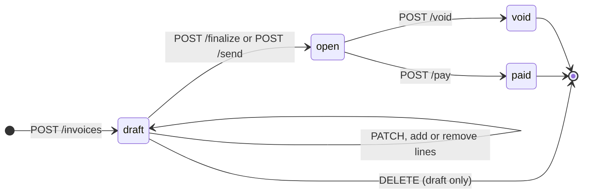

Every invoice is in one of four stored states: `draft`, `open`, `paid` or `void`. A fifth status, `overdue`, is worked out when the invoice is read.

There's no way out of `paid` or `void`. Voiding a paid invoice would need a credit note, which v1 doesn't support.

## States

<AccordionGroup>
  <Accordion title="draft" icon="pen">
    A work in progress. It has **no number** (`"number": null`) and owes nothing (`amount_due: 0`).

    - Edit it with `PATCH /invoices/{id}`, and add or remove lines with `POST /invoice-items` and `DELETE /invoice-items/{id}`.
    - Delete it outright with `DELETE /invoices/{id}`, which returns `204`.
    - Finalize it to assign a number.
  </Accordion>
  <Accordion title="open" icon="envelope-open">
    Finalized and waiting for payment. It has a permanent `number`, and `finalized_at` is set. `amount_due` equals `total`.

    - The document is frozen. Edits, line changes and deletes return `409 invalid_state`.
    - You can email it (`send`), mark it paid (`pay`) or void it (`void`).
  </Accordion>
  <Accordion title="paid" icon="circle-check">
    Settled. `paid_at` is set and `amount_due` is `0`. A paid invoice can't be voided or paid again. You can still email it again with `send`.
  </Accordion>
  <Accordion title="void" icon="ban">
    Retired. It **keeps its number**, so your series has no gaps, and `voided_at` and `void_reason` are set. A void invoice can't be sent, paid or edited.
  </Accordion>
</AccordionGroup>

## What each state allows

| Call | `draft` | `open` / `overdue` | `paid` | `void` |
|---|---|---|---|---|
| `PATCH /invoices/{id}` | Yes | `409` | `409` | `409` |
| `DELETE /invoices/{id}` | Yes (`204`) | `409` | `409` | `409` |
| `POST /invoice-items` | Yes | `409` | `409` | `409` |
| `DELETE /invoice-items/{id}` | Yes, but not the last line | `409` | `409` | `409` |
| `POST /invoices/{id}/finalize` | Yes → `open` | No-op, returns the invoice | No-op | No-op |
| `POST /invoices/{id}/send` | Finalizes, then emails | Emails | Emails again | `409` |
| `POST /invoices/{id}/pay` | `409` | Yes → `paid` | `409` | `409` |
| `POST /invoices/{id}/void` | `409` | Yes → `void` | `409` (needs a credit note) | `409` |

`409` responses use `code: "invalid_state"`, and the `detail` says why, for example `"Invoice is draft and cannot be marked paid."`

## Finalizing and numbering

`POST /invoices/{id}/finalize` (scope `invoices:finalize`, `Idempotency-Key` required):

1. Locks the invoice row, so two concurrent calls can't both claim a number.
2. Checks that the invoice has **at least one line item**. Otherwise it returns `409`.
3. Takes the next number in your business's series. It's your invoice prefix and a zero-padded counter, like `INV-0042`, and you set both in the web app.
4. Sets `status` to `open` and `finalized_at` to now, and records an `invoice.finalized` event.

If the invoice already has a number, finalize returns it unchanged and never assigns a second one. Together with the required [`Idempotency-Key`](/idempotency), this means a retry can't leave a gap in your series.

## Sending

`POST /invoices/{id}/send` (scope `invoices:send`, `Idempotency-Key` required, [10 per hour](/rate-limits)) emails the invoice PDF and a link to view it online.

- It emails the customer's stored `email`, unless you pass `{ "to": "someone@example.com" }`. With neither, it returns `422` with an error on `to`.
- A draft is **finalized first**, so "create and email" is a single call. `invoices:send` is the only scope this needs.
- The response is the invoice, like every other action, plus the address it went to: `{ "data": Invoice, "emailed_to": "ap@acme.example" }`.
- If the email provider fails **after** the invoice is finalized, you get `502 upstream_failed`. The invoice keeps its number, since a number already spent can't be taken back, and an `invoice.email_failed` event is recorded. Retry the send once the problem is fixed.

## Paying

`POST /invoices/{id}/pay` (scope `payments:write`, `Idempotency-Key` required) accepts an optional body:

<ParamField body="paid_on" type="string">
  When the payment happened, as an ISO 8601 date or timestamp. It becomes `paid_at`. Defaults to now.
</ParamField>
<ParamField body="reference" type="string">
  Your payment reference, like a bank transfer id. It's saved on the `invoice.paid` event's `meta`.
</ParamField>

Only an `open` invoice (including an overdue one) can be marked paid. This call records a payment. It doesn't move any money.

## Voiding

`POST /invoices/{id}/void` (scope `invoices:finalize`, `Idempotency-Key` required) needs a reason:

<ParamField body="reason" type="string" required>
  Why the invoice is void. An empty or missing reason returns `422`.
</ParamField>

Only `open` invoices can be voided. Use `DELETE` for a draft. A paid invoice can't be voided.

## Editing drafts

`PATCH /invoices/{id}` is a partial update. Send any of `customer`, `currency`, `collection_method`, `due_date`, `description`, `footer` and `items`. Fields you leave out keep their current values.

<Warning>
  `items`, when present, **replaces every line** on the draft. Leave it out to keep the lines. To change one line, use `POST /invoice-items` and `DELETE /invoice-items/{id}`, which return the whole recalculated invoice.
</Warning>

`days_until_due` only applies on create. On a `PATCH`, set `due_date` directly.

## Overdue

`overdue` is never stored, so no job flips invoices to overdue in the background. An `open` invoice is reported as `overdue` once the **UTC** calendar day after its `due_date` begins. An invoice due on the 20th becomes overdue at 00:00 UTC on the 21st. An invoice with no `due_date` is never overdue, and a paid invoice stays `paid` however late it was.

For the same reason there's no `invoice.overdue` webhook. To find overdue invoices, list `GET /invoices?status=overdue`.

## History

`GET /invoices/{id}/events` returns the invoice's history, newest first, [cursor-paginated](/pagination). Each event is `{ id, type, meta, created_at }`. Event types match the [webhook events](/webhooks#events): `invoice.created`, `invoice.updated`, `invoice.finalized`, `invoice.emailed`, `invoice.email_failed`, `invoice.viewed`, `invoice.downloaded`, `invoice.paid` and `invoice.voided`.

`invoice.viewed` and `invoice.downloaded` are recorded when your customer opens the public invoice link or downloads its PDF. They're how you can tell a customer actually looked at the invoice.
