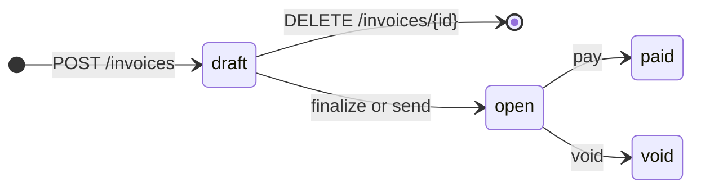

```mermaid
stateDiagram-v2
    direction LR
    [*] --> draft: POST /invoices
    draft --> [*]: DELETE /invoices/{id}
    draft --> open: finalize or send
    open --> paid: pay
    open --> void: void
```

| Status | Meaning |
|---|---|
| `draft` | Editable. No `number` yet, and `amount_due` is `0`. |
| `open` | Finalized. It has a permanent `number` and `amount_due` equals `total`. |
| `overdue` | An `open` invoice past its `due_date`. See [Overdue](#overdue). |
| `paid` | Marked paid. `paid_at` is set and `amount_due` is `0`. Final. |
| `void` | Cancelled. It keeps its number, with `voided_at` and `void_reason` set. Final. |

## Calls

| Call | Scope | Does |
|---|---|---|
| `POST /invoices/{id}/finalize` | `invoices:finalize` | Assigns the next number (like `INV-0042`) and moves a draft to `open`. The draft needs at least one line. |
| `POST /invoices/{id}/send` | `invoices:send` | Emails the invoice. Finalizes a draft first. |
| `POST /invoices/{id}/pay` | `payments:write` | Marks an `open` invoice paid. Optional `paid_on` (ISO date) and `reference` (up to 200 characters). No money moves. |
| `POST /invoices/{id}/void` | `invoices:finalize` | Voids an `open` invoice. `reason` is required (up to 500 characters). |
| `PATCH /invoices/{id}` | `invoices:write` | Edits a draft. Fields you leave out keep their values. |
| `DELETE /invoices/{id}` | `invoices:write` | Deletes a draft. Returns `204`. |

All four lifecycle actions need an [`Idempotency-Key`](/idempotency).

## What each status allows

| Call | `draft` | `open` / `overdue` | `paid` | `void` |
|---|---|---|---|---|
| `PATCH`, `DELETE`, add or remove lines | Yes | `409` | `409` | `409` |
| `finalize` | → `open` | Returns it unchanged | Returns it unchanged | Returns it unchanged |
| `send` | Finalizes, then emails | Emails | Emails again | `409` |
| `pay` | `409` | → `paid` | `409` | `409` |
| `void` | `409` | → `void` | `409` | `409` |

A refused call returns `409 invalid_state`, and `detail` says why.

<Warning>
  On `PATCH /invoices/{id}`, `items` **replaces every line**. To change one line, use `POST /invoice-items` and `DELETE /invoice-items/{id}`. A draft must keep at least one line.
</Warning>

## Sending

`send` emails the PDF and a link to the online invoice to the customer's `email`, or to `to` if you pass it.

- Your account email must be verified. Otherwise you get `409 invalid_state`.
- With no customer email and no `to`, you get `422`.
- Limited to 10 per hour per key and 50 per hour per account. See [Rate limits](/rate-limits).

## Overdue

`overdue` is never stored. An `open` invoice reads as `overdue` from 00:00 UTC on the day after its `due_date`. An invoice with no `due_date` is never overdue.

To find overdue invoices, call `GET /invoices?status=overdue`. There's no `invoice.overdue` webhook.

## History

`GET /invoices/{id}/events` returns the invoice's events, newest first. The event types match the [webhook events](/webhooks#events).
