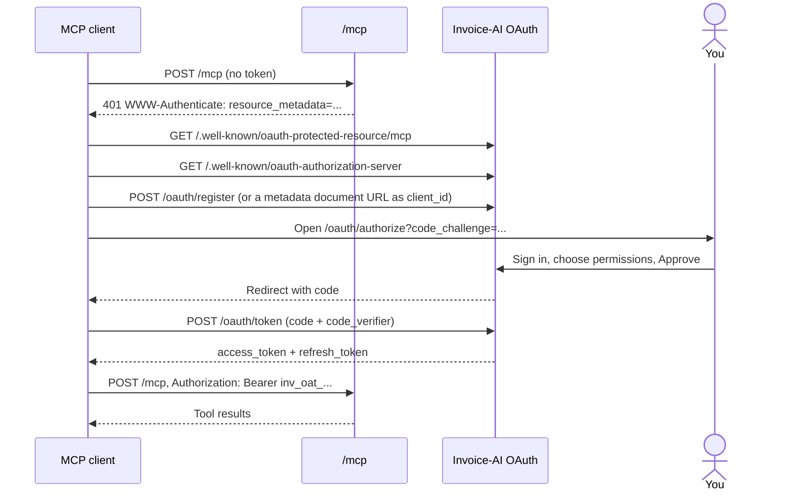

Every request to `https://invoice.horizonpay.co/mcp` needs a Bearer credential. There are two kinds:

- **OAuth (recommended).** The client signs you in and you approve it. Claude, ChatGPT, Claude Code and Cursor do this on their own. You only give them the URL.
- **An API key**, for clients that let you set headers.

## OAuth

You don't need to configure anything. This section is for people building an MCP client, or curious about what happens when you connect.

### Discovery

A client starts with nothing but the server URL:

1. It calls `/mcp` without a token and gets `401` with a `WWW-Authenticate` header:

   ```http
   WWW-Authenticate: Bearer error="invalid_token", error_description="No credential provided.", resource_metadata="https://invoice.horizonpay.co/.well-known/oauth-protected-resource/mcp", scope="business:read clients:read products:read invoices:read clients:write invoices:write invoices:finalize invoices:send payments:write"
   ```

2. It fetches `resource_metadata` ([RFC 9728](https://www.rfc-editor.org/rfc/rfc9728)). That names the authorization server, `https://invoice.horizonpay.co`.
3. It fetches `/.well-known/oauth-authorization-server` ([RFC 8414](https://www.rfc-editor.org/rfc/rfc8414)) to find the endpoints below.
4. It identifies itself in one of two ways:
   - **Client ID Metadata Document.** Its `client_id` is an `https://` URL serving its own metadata. The consent screen shows its domain as verified.
   - **Dynamic registration** ([RFC 7591](https://www.rfc-editor.org/rfc/rfc7591)). It posts its metadata to `/oauth/register` and gets a `client_id`. The consent screen marks it **Unverified app** and shows where you'll be sent back to.
5. It sends you to `/oauth/authorize` with a PKCE `code_challenge` (`S256` only). You sign in, if needed, and approve.
6. It exchanges the code at `/oauth/token` with the `code_verifier`, and gets an access token and a refresh token.
7. It calls `/mcp` with `Authorization: Bearer inv_oat_...`.



### Endpoints

| Endpoint | URL |
|---|---|
| Protected resource metadata | `https://invoice.horizonpay.co/.well-known/oauth-protected-resource/mcp` |
| Authorization server metadata | `https://invoice.horizonpay.co/.well-known/oauth-authorization-server` |
| Authorize | `https://invoice.horizonpay.co/oauth/authorize` |
| Token | `https://invoice.horizonpay.co/oauth/token` |
| Register | `https://invoice.horizonpay.co/oauth/register` |
| Revoke ([RFC 7009](https://www.rfc-editor.org/rfc/rfc7009)) | `https://invoice.horizonpay.co/oauth/revoke` |

- Grant types: `authorization_code` and `refresh_token`.
- Client authentication at the token endpoint: `none` (public clients, protected by PKCE), `client_secret_basic` or `client_secret_post`.
- Redirect URIs: any `https://` URL, `http://` on `127.0.0.1`, `[::1]` or `localhost` (any port), or a private-use scheme like `com.example.app:/callback`. They're matched exactly, except the loopback port.
- The redirect back carries `iss` ([RFC 9207](https://www.rfc-editor.org/rfc/rfc9207)).

### Permissions

The consent screen groups scopes by risk:

| Group | Scopes | Default |
|---|---|---|
| Look things up | `business:read`, `clients:read`, `products:read`, `invoices:read` | Ticked |
| Create customers and draft invoices | `clients:write`, `invoices:write` | Ticked |
| Finalize, email, and record payments | `invoices:finalize`, `invoices:send`, `payments:write` | Never pre-ticked, even if the client asks |

`webhooks:manage` and `products:write` are never offered to an MCP client.

A scope also grants what it needs to work. For example, `invoices:write` adds `business:read`, `clients:read` and `invoices:read`, and `invoices:send` adds `invoices:read`. The consent screen shows this next to each scope.

### Tokens

| Token | Prefix | Lifetime |
|---|---|---|
| Access token | `inv_oat_` | 1 hour |
| Refresh token | `inv_ort_` | 30 days. Rotated on every use: each refresh returns a new refresh token and the old one stops working. |

- If a used refresh token is presented again, Invoice-AI assumes it was stolen and revokes every token from that sign-in. You connect again.
- A refresh can keep or narrow the scopes, never widen them.
- Tokens are bound to an audience ([RFC 8707](https://www.rfc-editor.org/rfc/rfc8707)). A token issued for `/mcp` is rejected by `/api/v1`, and a token for `/api/v1` is rejected by `/mcp`.

### Revoke access

Disconnect an app in [Settings → AI assistants](https://invoice.horizonpay.co/settings/ai-assistants). Its tokens stop working on the next request. Its past calls stay in [Settings → Activity](https://invoice.horizonpay.co/settings/activity).

## Use an API key

For clients that let you set headers, send an API key as a Bearer token:

```bash
claude mcp add --transport http invoice-ai https://invoice.horizonpay.co/mcp \
  --header "Authorization: Bearer inv_live_..."
```

<Tip>
  Create a separate key for each assistant, with the **AI assistant** preset in [Settings → API keys](https://invoice.horizonpay.co/settings/api-keys). It can look things up and prepare drafts, but can't finalize, send or mark anything paid. Add those scopes only if you need them.
</Tip>

A key used for MCP is the same key as for the REST API. It has the same scopes, and it shares the same [rate limits](/rate-limits) with your other uses of that key.

## OAuth for the REST API

App developers can use the same authorization server to call the [REST API](/api-reference/introduction) on a user's behalf. Send `resource=https://invoice.horizonpay.co/api/v1` on the authorize and token requests, and ask for the scopes you need. All 11 [scopes](/authentication#scopes) can be requested. The resource metadata is at `https://invoice.horizonpay.co/.well-known/oauth-protected-resource/api/v1`.
