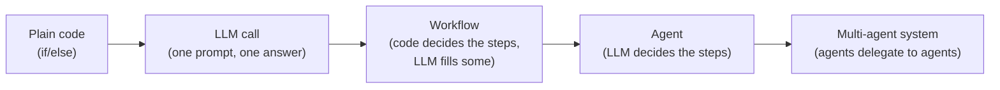
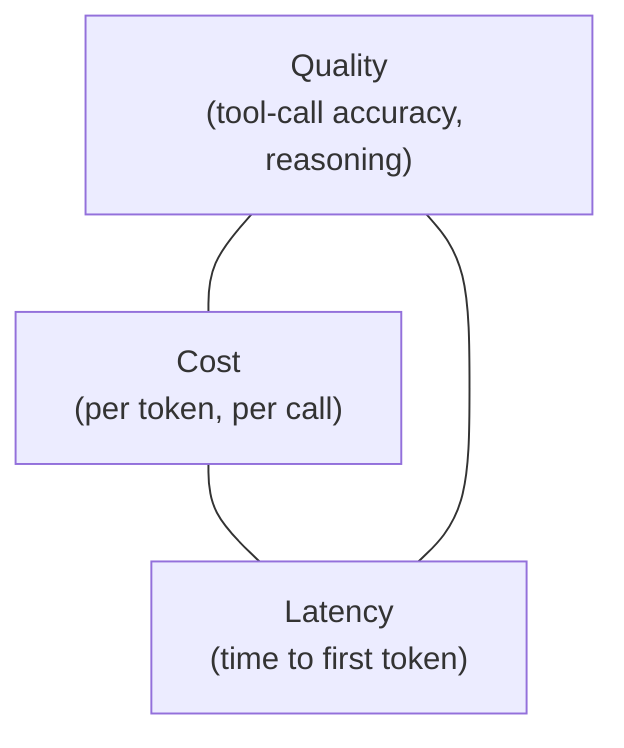
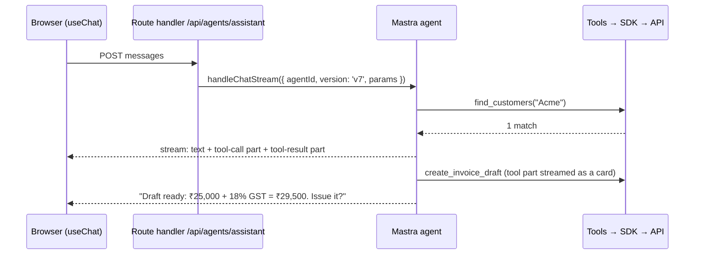
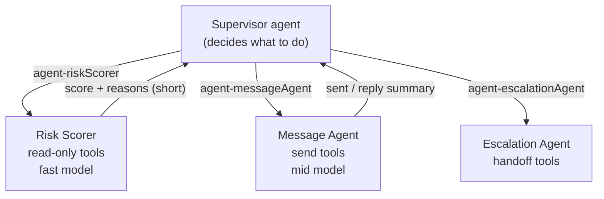
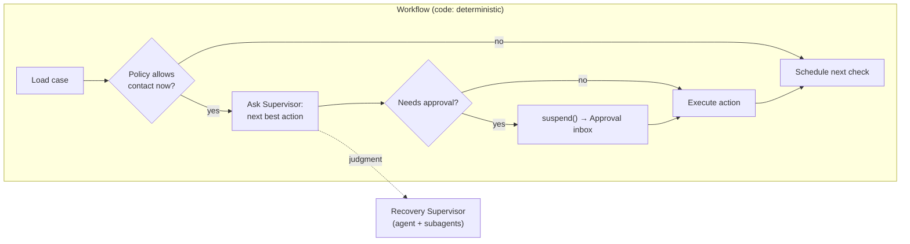
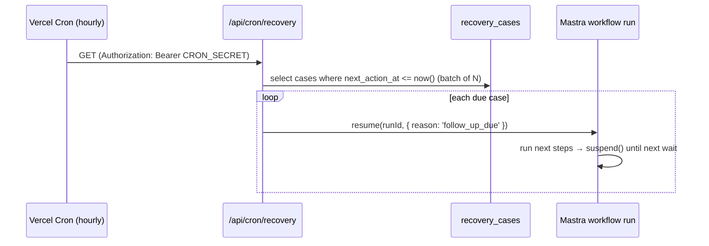
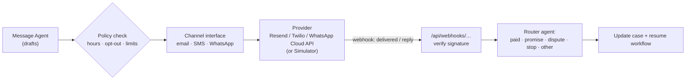
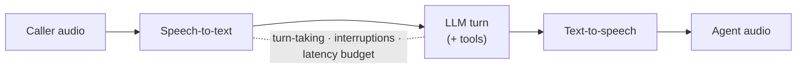
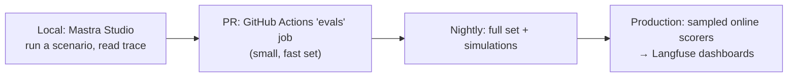
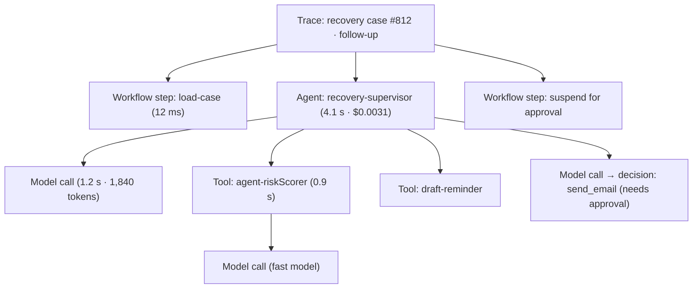

# 01 · Agents and subagents: from zero to production

> **Read first:** [../platform/README.md](../platform/README.md). Agents sit on top of the platform layer: foundation, API, SDK, CLI and MCP.
> **Build spec that applies this doc:** [02-recovery-agent-and-invoice-assistant.md](02-recovery-agent-and-invoice-assistant.md).
> **Status:** planning and teaching document. Code blocks are **illustrative, shape only**. Check library APIs against current docs when you build (see [§18](#18-verify-at-build-time)).

## How to use this document

Each chapter follows the same pattern so you can teach it slide by slide:

1. **Analogy:** a plain-language picture.
2. **What it is:** the definition.
3. **How it works:** the mechanics.
4. **In Invoice-AI:** where it shows up in our product.
5. **Show the students:** a live demo or code moment.
6. **Common mistakes:** what goes wrong in real projects.

The stack we teach with, and why:

| Layer | Choice in this course | Why |
|---|---|---|
| Agent framework | **Mastra** (`@mastra/core`) | Agents, subagents, workflows with suspend/resume, memory, evals (scorers) and tracing, plus a visual **Studio**, all in one TypeScript framework |
| Chat UI | **AI SDK UI** (`@ai-sdk/react` `useChat`) | The industry-standard React chat hook. Mastra streams into it via `@mastra/ai-sdk` |
| Models | **OpenRouter** (free models while learning), switchable to **OpenAI** | One key and many models. Switching is a one-line env change |
| Voice | **ElevenLabs Agents** (browser sessions, simulated customers) | Realistic voice without phone numbers or telephony compliance while learning |
| Storage | **Neon Postgres** (`@mastra/pg`) | Already our database. Serverless functions need external storage |
| Observability | **Mastra Studio** locally, **Langfuse** in production | See every step, tool call, token and cost |
| Hosting | **Vercel** (inside our Next.js app) | Same CI/CD pipeline students already know |

---

## Contents

1. [What an agent is](#1-what-an-agent-is)
2. [The agent loop, by hand](#2-the-agent-loop-by-hand)
3. [Tools: the agent's hands](#3-tools-the-agents-hands)
4. [Models and providers](#4-models-and-providers)
5. [Conversation and UI](#5-conversation-and-ui)
6. [Context engineering and memory](#6-context-engineering-and-memory)
7. [Subagents](#7-subagents)
8. [Orchestration patterns](#8-orchestration-patterns)
9. [Durable and background agents](#9-durable-and-background-agents)
10. [Human in the loop](#10-human-in-the-loop)
11. [Channels and voice](#11-channels-and-voice)
12. [Evals](#12-evals)
13. [Observability](#13-observability)
14. [Guardrails, safety and compliance](#14-guardrails-safety-and-compliance)
15. [Deploying and operating agents](#15-deploying-and-operating-agents)
16. [Ecosystem map](#16-ecosystem-map)
17. [Glossary and teaching path](#17-glossary-and-teaching-path)
18. [Verify at build time](#18-verify-at-build-time)

---

## 1. What an agent is

**Analogy.** A calculator does exactly what you press. A junior accountant gets a goal ("chase the unpaid invoices"), decides which files to open, whom to email and when to ask the manager, and reports back. An agent is the junior accountant.

**What it is.** An agent is a **language model that uses tools in a loop until a goal is reached**.
- **Model:** decides the next step.
- **Tools:** functions it can call (look up invoices, send an email).
- **Loop:** repeats "think → act → observe" until a **stop condition** is met: the goal is done, a step limit is hit, or a human is needed.

**How it works: the autonomy spectrum.**



Moving right buys flexibility but costs predictability, cost, latency and testability. **Pick the leftmost option that solves the problem.**

| Use plain code or a workflow when… | Use an agent when… |
|---|---|
| The steps are known and fixed ("every 7 days send reminder #2") | The next step depends on messy input ("customer replied: 'paid half, rest next week?'") |
| Correctness is mathematical (GST totals) | Judgment is needed (tone, whether to escalate) |
| Mistakes are costly and rules are clear | The task varies too much to write rules for |

**In Invoice-AI.**
- Today's AI feature (`app/api/ai/parse-invoice/route.ts`) is a **single LLM call**: text in, structured draft out. It isn't an agent.
- The **Invoice Assistant** we'll build is an agent: it decides whether to look up a customer, create a product, or ask a question.
- The **Recovery Agent** is a **multi-agent system run by a workflow**. Code owns the schedule and the rules; agents own the judgment calls.

**Show the students.** Claude Code is an agent they've used all course. It reads files (a tool), runs commands (a tool), sees the results (observe) and decides what to do next (loop). Ask them: "What were Claude Code's stop conditions today?" It stopped when the task was done, when it needed permission, or when it hit an error it couldn't fix.

**Common mistakes.**
- Using an agent for something a `for` loop does perfectly.
- No step limit, so a confused agent loops and burns money.
- Letting the model do arithmetic or compliance decisions that code should own.

---

## 2. The agent loop, by hand

**Analogy.** A chess player: look at the board, choose a move, see the opponent's reply, repeat until checkmate or a draw.

**What it is.** The core loop every framework hides:

```
messages = [system instructions, user goal]
repeat up to MAX_STEPS:
    response = model(messages, tool_definitions)
    if response has no tool calls:  return response.text      ← stop: done
    for each tool call:
        result = run_tool(name, validated_args)
        messages.append(tool call, result)                      ← observe
return "stopped: step limit reached"                            ← stop: safety
```

**How it works: the raw version (illustrative, AI SDK 7 style).** The AI SDK's `ToolLoopAgent` is the smallest real implementation:

```ts
import { ToolLoopAgent, tool, isStepCount } from 'ai'
import { z } from 'zod'

const agent = new ToolLoopAgent({
  model: 'openrouter/<free-model-id>',          // any provider/model
  instructions: 'You help a small business check overdue invoices.',
  tools: {
    list_overdue: tool({
      description: 'List invoices past their due date, oldest first.',
      inputSchema: z.object({ limit: z.number().int().min(1).max(20) }),
      execute: async ({ limit }) => sdk.invoices.list({ status: 'overdue', limit }),
    }),
  },
  stopWhen: isStepCount(8),                     // safety stop
})

const result = await agent.generate({ prompt: 'Who owes me the most?' })
console.log(result.steps.length, result.text)
```

The same agent in **Mastra** (the course default) adds identity, memory, tracing and Studio:

```ts
import { Agent } from '@mastra/core/agent'

export const overdueAgent = new Agent({
  id: 'overdue-agent',
  name: 'Overdue Agent',
  instructions: 'You help a small business check overdue invoices.',
  model: process.env.AGENT_MODEL!,              // e.g. "openrouter/<id>" or "openai/<id>"
  tools: { listOverdue },                       // created with createTool (chapter 3)
})

const res = await overdueAgent.generate('Who owes me the most?', { maxSteps: 8 })
```

**Key controls every student should know:**
- **Max steps / stop conditions:** the circuit breaker.
- **Cancellation:** an `AbortSignal` that stops the loop when the user closes the chat.
- **Streaming:** send tokens and tool events to the UI as they happen, rather than waiting.
- **Steps array:** the full record of what the agent did, which is the raw material for evals and tracing.

**Show the students.** Run the agent in **Mastra Studio** and open the trace: model call → `list-overdue` tool → model call → final text. Then set max steps to 1 and watch it stop before answering.

**Common mistakes.** Swallowing tool errors, so the model thinks a failed tool succeeded; putting business logic in the prompt instead of the tool.

---

## 3. Tools: the agent's hands

**Analogy.** A new employee reads the job's tool manual. If the manual says "handles invoices", they'll guess. If it says "creates a DRAFT; issuing is a separate, irreversible step", they'll do it right.

**What it is.** A tool is a **name + description + input schema + output schema + execute function**. The model only ever sees the first four, so **tool design is prompt design**.

**How it works (Mastra `createTool`, shape only):**

```ts
import { createTool } from '@mastra/core/tools'
import { z } from 'zod'

export const createInvoiceDraft = createTool({
  id: 'create-invoice-draft',
  description: [
    'Create a DRAFT GST invoice. Drafts have no invoice number and can be edited.',
    'rate is the PRE-TAX price per unit in rupees. If the user gave a tax-inclusive amount or it is unclear, ask first.',
    'gst_rate must be one of 0, 5, 12, 18, 28. Never guess it.',
  ].join('\n'),
  inputSchema: z.object({
    customer_id: z.string().uuid(),
    due_date: z.string().date().optional(),
    items: z.array(z.object({
      description: z.string().min(1),
      quantity: z.number().positive(),
      rate_rupees: z.number().nonnegative(),
      gst_rate: z.union([z.literal(0), z.literal(5), z.literal(12), z.literal(18), z.literal(28)]),
    })).min(1),
  }),
  outputSchema: z.object({ invoice_id: z.string(), total_label: z.string(), tax_note: z.string() }),
  execute: async (input, context) => {
    const sdk = sdkFor(context)                  // scoped to the signed-in owner
    const draft = await sdk.invoices.createDraft(toApiBody(input), {
      idempotencyKey: `draft:${context?.runId}:${hash(input)}`,
    })
    return { invoice_id: draft.id, total_label: draft.total_label, tax_note: draft.tax_note }
  },
})
```

**Design rules (with the Invoice-AI reason):**

| Rule | Why |
|---|---|
| **Verb-noun names:** `find_customers`, `create_invoice_draft` | The model picks tools by name first |
| **Descriptions state rules and when to ask** | Vague tools get guessed at |
| **Strict schemas** (enums, min/max, formats) | The model can't invent a 17% GST rate if the schema forbids it |
| **Units the model handles well** (rupees in, paise inside) | Models are bad at paise arithmetic, and `lib/money.ts` is good at it |
| **Small outputs** (summaries, ids, labels) | Every token returned is context the model must carry |
| **Actionable errors:** "Invoice already issued as INV/26-27/0042; use get_invoice" | The model can recover instead of retrying blindly |
| **Idempotency keys on writes** | Agents retry. See [../platform/01-api.md §3.6](../platform/01-api.md) |
| **Call the SDK/API, never the database** | Scopes, rate limits, audit and GST rules are enforced once, in the platform |
| **No bulk or destructive-by-default tools** | A tool the model doesn't have is a mistake it can't make |

**Tool sources.**
1. **Your own tools** wrapping `@invoice-ai/sdk` ([../platform/02-sdk.md](../platform/02-sdk.md)).
2. **MCP servers:** Mastra and the AI SDK can load tools from MCP. Our own MCP server ([../platform/04-mcp.md](../platform/04-mcp.md)) exposes the same tools to Claude Desktop.
3. **Provider tools** (web search, code execution), which run on the model provider's side.

**Show the students.** Replace a good description with "handles invoices" and run the same eval prompt. The agent picks the wrong tool. Put the description back and it's right again.

**Common mistakes.**
- A tool per database table.
- Returning whole rows.
- Letting the model compute totals, which should come from `lib/gst.ts#computeInvoice` behind the API.

---

## 4. Models and providers

**Analogy.** Hiring. A senior specialist (a large, expensive model) for hard judgment, and an efficient assistant (a small, cheap model) for routine sorting. You wouldn't pay the specialist to file paperwork.

**What it is.** The model is the agent's brain. A **provider** serves models (OpenAI, Anthropic, Google). A **gateway/router** gives one API over many providers (OpenRouter, Vercel AI Gateway).

**How it works in Mastra.** Models are strings of the form `provider/model`:

```ts
model: 'openrouter/<model-id>'   // reads OPENROUTER_API_KEY
model: 'openai/<model-id>'       // reads OPENAI_API_KEY
```

We read the model id from env (`AGENT_MODEL`, plus a cheaper `AGENT_MODEL_FAST` for simple subagents), so switching provider is **a config change, not a code change**.

**Choosing a model: the triangle.**



| Job in our agents | Needs | Model tier |
|---|---|---|
| Recovery Supervisor (decides next action) | Reliable tool calling, judgment | Strongest you can afford |
| Risk Scorer, classifier, summaries | Cheap, fast, structured output | Small/fast model |
| Message drafting | Tone, instruction following | Mid tier |
| Voice conversation | **Low latency** above all | Voice-optimised model inside ElevenLabs |
| LLM-as-judge (evals) | Consistency | Mid/strong, fixed version |

**OpenRouter free models: what to teach honestly.**
- **Good for:** learning, demos, CI smoke evals on a small dataset.
- **Limits:** rate limits and daily caps, variable availability, and many free models have **weaker or missing tool calling**.
- **Rule:** pick a free model that lists tool/function-calling support, and let **evals decide** when to upgrade ([§12](#12-evals)).
- **Fallbacks:** configure a second model for when the first is rate-limited, since gateways and routers support fallback lists.

**Structured output.** Ask for a zod-typed object rather than free text whenever code consumes the result (risk score, promise-to-pay date). The existing parser already does this with `Output.object` in `app/api/ai/parse-invoice/route.ts`.

**Common mistakes.**
- Hard-coding one provider.
- Using the biggest model everywhere.
- Changing models without re-running evals.
- Trusting "free" in production.

---

## 5. Conversation and UI

**Analogy.** A good waiter repeats your order back before sending it to the kitchen.

**What it is.** The agent's interface: streaming text, visible tool activity, clarifying questions, and confirmation before irreversible actions.

**How it works.**



- **Server:** `@mastra/ai-sdk` `handleChatStream({ mastra, agentId, version: 'v7', params })` returns a stream wrapped by `createUIMessageStreamResponse`.
- **Client:** `useChat` from `@ai-sdk/react` renders **message parts**: text, tool calls and tool results. Tool parts become **cards** (a customer card, or an invoice card with the GST split). This is "generative UI".
- **Clarifying questions are a feature.** "Is ₹25,000 before or after GST?" beats a wrong invoice.
- **Confirmation cards** for irreversible steps (issue, send) come from **tool approvals** ([§10](#10-human-in-the-loop)).

**In Invoice-AI.** `components/invoice/ai-panel.tsx` already shows the principle: the AI proposes, a **summary card** shows totals computed by real code (`components/invoice/ai-summary.ts` → `computeInvoice`), and the user clicks **"Fill this in"**. The Invoice Assistant generalises this to many tools.

**Next.js 16 note.** Server Actions run one at a time per client, so streaming chat belongs in a **route handler**, not a Server Action (`node_modules/next/dist/docs/01-app/02-guides/server-actions.md`).

**Common mistakes.**
- Hiding tool activity, so users don't trust "done".
- Rendering model-computed totals.
- No stop button.
- Losing the chat on refresh (persist threads, [§6](#6-context-engineering-and-memory)).

---

## 6. Context engineering and memory

**Analogy.** Briefing a consultant. Hand them the three relevant files, not the entire filing cabinet, and keep a notebook of what they learned about each client.

**What it is.** **Context engineering** is deciding what the model sees at each step. **Memory** is what persists between turns and sessions.

**How it works: four kinds of context.**

| Kind | Lives in | Example in Invoice-AI | Mastra feature |
|---|---|---|---|
| **Instructions** | The agent definition | Tone, policies, "never guess GST rate" | `instructions` |
| **Conversation history** | A thread | This chat's last N messages | `Memory` with `lastMessages` |
| **Working memory** | Per resource (user/customer) | "Acme pays ~10 days late; prefers email; contact: accounts@" | `workingMemory` (template) |
| **Retrieved knowledge** | Tools or vector search | Payment history (SQL tool), HSN/SAC code lookup | Tools; `semanticRecall` / `PgVector` |

```ts
// shape only
import { Memory } from '@mastra/memory'
import { PostgresStore } from '@mastra/pg'

const memory = new Memory({
  storage: new PostgresStore({ id: 'agents', connectionString: process.env.DATABASE_URL!, schemaName: 'mastra' }),
  options: {
    lastMessages: 20,
    workingMemory: { enabled: true, template: '# Customer\n- Preferred channel:\n- Payment habit:\n- Contact person:\n' },
  },
})

await agent.stream(userMessage, { memory: { thread: chatId, resource: ownerId } })
```

- **`thread`** is one conversation. **`resource`** is the owner of the memory: the business owner for the Assistant, the customer case for Recovery.
- Resource-scoped working memory is shared across threads, which is useful when the Message Agent and Voice Agent both work on the same customer.

**Tools beat RAG for structured data.** "Who pays late?" is a SQL question, so give the agent a `payment_history` tool that returns computed facts. Use vector search (RAG) for **unstructured** text: HSN/SAC descriptions, policy documents, past call transcripts.

**Rule: facts come from tools, not memory.** Memory says "Acme usually pays late". The amount owed always comes from `get_invoice`, never from what the model remembers.

**Common mistakes.**
- Stuffing whole databases into prompts.
- Letting memory store amounts or dates as truth.
- Mixing tenants' memories (always scope `resource` by owner).
- Unbounded history that grows forever.

---

## 7. Subagents

**Analogy.** A law firm partner doesn't read every document. They send an associate to research and get back a one-page memo. The partner's desk stays clear.

**What it is.** A **subagent** is an agent that another agent calls **like a tool**. It has its own instructions, tools, model and **context window**, and returns a focused result.

**How it works.**



- **In Mastra:** add agents to a supervisor's `agents: { riskScorer, messageAgent }`. Each becomes a tool the supervisor can call, so every subagent needs a clear `description` for the supervisor to delegate well.
- **In the AI SDK:** a tool whose `execute` calls another agent. `toModelOutput` controls how much of the subagent's work the parent model actually sees.

**When to use subagents (and when not):**

| Use a subagent when… | Don't when… |
|---|---|
| The job needs **different tools or permissions** (only the Voice Agent can start calls) | One agent with 5 tools does it fine |
| The work is **context-heavy** (reading 40 past messages) and only a summary matters | Context stays small |
| Work can run **in parallel** | Steps are strictly sequential (use a workflow) |
| You want **a different model tier** (cheap classifier vs strong planner) | The extra latency and cost aren't worth it |

**Rule for students:** start with one agent. Promote a capability to a subagent **when evals or traces show the single agent struggling**. Examples: wrong tool choices as tools multiply, context overflow, or a permission you don't want every step to have.

**Common mistakes.**
- "Agent per noun" architectures.
- Subagents passing huge transcripts back to the parent.
- No descriptions, so the supervisor can't delegate.
- Letting subagents call each other freely (loops).

---

## 8. Orchestration patterns

**Analogy.** A hospital. Some things follow a **protocol** (admission checklist). Some need a **triage nurse** who routes you. Some need a **specialist team** coordinated by a lead doctor.

**What it is.** Orchestration decides **who does what, in what order, and who decides**. The core rule of this course:

> **Workflows own control flow. Agents own judgment.**
> Put schedules, retries, limits, approvals and state transitions in code (a workflow). Ask an agent only the questions that need judgment: what to say, how risky, whether the reply is a dispute.

**The patterns.**

| Pattern | Shape | Use it for | In Invoice-AI |
|---|---|---|---|
| **Sequential workflow** | A → B → C | Fixed pipelines | Assess case → pick channel → contact → log |
| **Parallel (fan-out / fan-in)** | A → (B, C, D) → merge | Independent work | Score risk for 30 overdue invoices at once |
| **Branching** | if/else on data | Rules | Opted out? Stop. Disputed? Escalate |
| **Router** | Classifier → one handler | Triage inputs | Classify an inbound reply: paid / promise / dispute / stop / other |
| **Supervisor-worker** | A lead agent delegates to subagents | Open-ended multi-skill work | Recovery Supervisor → Message / Voice / Escalation |
| **Handoff** | An agent transfers the conversation | Specialist takes over | Voice Agent hands off to a human with a summary |
| **Evaluator-optimizer** | Generate → critique → revise | Quality-sensitive output | Draft reminder → policy/tone checker → revise |
| **Plan-and-execute** | Plan steps, then execute each | Long tasks | Weekly recovery plan across all cases |
| **Agent network** | Agents route among themselves dynamically | Research-y, exploratory | Rarely right for money workflows; teach as a contrast |



**Mastra workflows (shape only):** steps with typed input and output, `.then()`, `.parallel()`, `.branch()`, `suspend()`/`resumeData` inside a step, and `commit()` to finalise. Run state is **snapshotted to storage**, so a suspended run can be resumed days later.

**Common mistakes.**
- Letting an agent decide "how many reminders per week" (that's policy code).
- Multi-agent chat free-for-alls on money workflows.
- No single owner of state.

---

## 9. Durable and background agents

**Analogy.** A courier company. If a van breaks down, the parcel isn't lost: the depot knows where it was and sends another van. Durable execution is the depot's tracking system.

**What it is.** Agents that run **without a user watching**: on a schedule, triggered by events, or waiting days between steps. They survive crashes, deploys and timeouts.

**How it works: the problems and the tools.**

| Problem | Why serverless makes it hard | Solution pattern |
|---|---|---|
| "Wait 3 days, then follow up" | A function can't sleep for 3 days (the Vercel default max is 300 seconds) | **Persist state and exit**, then a scheduler resumes it later |
| Crash mid-run | In-memory progress is lost | **Snapshots/checkpoints** after each step |
| Retries | A retry may re-send an email | **Idempotency keys** per action ([../platform/01-api.md §3.6](../platform/01-api.md)) |
| Waiting on a human or an external event | Nothing to hold the request open | **suspend()**, then resume on approval or webhook |
| Fan-out over many cases | Timeouts | A queue or a batch per cron tick |

**Our approach:** Mastra workflow snapshots in Postgres, plus **Vercel Cron**.



**Alternatives students should know** (see [§16](#16-ecosystem-map)):
- **Vercel Workflow** (with `@ai-sdk/workflow` `WorkflowAgent`): durable steps on Vercel.
- **Inngest** and **Trigger.dev**: event-driven durable functions with built-in sleep, wait-for-event and retries.
- **Temporal**: enterprise-grade durable execution.

**Common mistakes.**
- `setTimeout` or `after()` for multi-day waits (`after()` is bounded by the function's max duration).
- No idempotency on resume.
- Cron routes without a secret.
- Cron routes blocked by the login redirect in `proxy.ts` (`/api/cron/` is already exempt; any new prefix, such as `/api/webhooks/` or `/api/agents/`, isn't).

---

## 10. Human in the loop

**Analogy.** A bank lets a clerk handle small withdrawals, but a manager signs off large ones. The rule is written down, not left to the clerk's mood.

**What it is.** Designed points where a **human approves, edits, or takes over**. Policy decides when, not the model.

**How it works: approval tiers.**

| Tier | Examples | Default |
|---|---|---|
| **Read** | List overdue, get invoice, payment history | Auto |
| **Draft** | Create draft invoice, draft a reminder | Auto |
| **Send** | Issue invoice, send email/WhatsApp | **Approval** (can be relaxed per policy for low amounts or friendly reminders) |
| **Call** | Start a voice call | **Approval** |
| **Irreversible / sensitive** | Cancel invoice, write-off, dispute resolution | **Human only** (no tool) |

**Mechanisms.**
- **Tool-level approval** (Mastra): `requireApproval: true` on a tool, or `requireToolApproval` per call. The stream emits a `tool-call-approval` chunk, and the app calls `approveToolCall({ runId })` or `declineToolCall({ runId })`.
- **Workflow suspend:** a step calls `suspend({ summary })`. The run is saved and shows up in the **Approval inbox**, then resumes with `resumeData: { approved, editedMessage }`.
- **Escalation / handoff:** the agent stops acting and creates an escalation with a summary, transcript and suggested next step for a person.

**Designing the approval inbox (UX that works):**
- Show **what will happen**: channel, recipient, exact message, amount.
- Show **why**: the agent's reason and risk score.
- Offer **approve, edit then approve, reject, and snooze**.
- **Batch** similar approvals.
- **Expire** stale approvals, since the invoice may have been paid meanwhile.

**Common mistakes.**
- Approval prompts without context ("Approve tool call?").
- Approvals that don't re-check state before executing.
- Letting the model decide what needs approval.

---

## 11. Channels and voice

**Analogy.** A good collections clerk emails first, sends a WhatsApp nudge next, and calls only when needed, and always writes down what the customer said.

**What it is.** Getting an agent's decisions out into the world (**outbound**) and turning replies back into structured data (**inbound**).

**How it works: messaging.**



- **Channel interface** in code: `send(to, message, metadata) → providerMessageId` and `parseInbound(request) → { from, text, providerMessageId }`. A **Simulator** implementation lets students run everything with no accounts.
- **Store provider message ids.** Today `lib/email.tsx#sendInvoiceEmail` returns the Resend id and `lib/actions/send.ts` discards it. Agents must keep it to match replies and delivery events.
- **Always verify webhook signatures**, and exempt webhook routes from the login redirect.

**How it works: voice.**



- **Latency budget:** people notice gaps over about 1 second, so voice uses fast models and short turns.
- **Interruptions:** the caller talks over the agent, so it must stop and listen.
- **Structured outcomes:** the conversation must end in data such as `promise_to_pay_date`, `dispute_reason` or `wants_human`, not only a transcript.
- **ElevenLabs Agents** handle the ASR/LLM/TTS pipeline:
  - **Browser session:** `@elevenlabs/react` `useConversation().startSession({ signedUrl | conversationToken, dynamicVariables, clientTools })`. Use a server route to create the signed URL, so the API key never reaches the browser.
  - **Post-call webhook:** `post_call_transcription` carries `transcript`, `analysis.transcript_summary`, `analysis.data_collection_results` and `analysis.evaluation_criteria_results`. Verify it with `webhooks.constructEvent` (HMAC).
  - **Simulated conversations** via the API, for automated testing ([§12](#12-evals)).
- **Telephony** (real phone calls through Twilio or SIP) comes later. This course uses **browser calls and simulated customers**, so there are no phone numbers, costs or calling-law exposure while learning.

**Common mistakes.**
- Voice agents that improvise amounts.
- No disclosure that the caller is an AI.
- Transcripts stored with no structured outcome.
- Replies not linked back to the invoice.

---

## 12. Evals

**Analogy.** Unit tests check that a function returns 4 for 2+2. Evals check that an agent **behaves** well across realistic situations: does it escalate a dispute, stay silent after "stop contacting me", and ask before guessing a GST rate?

**What it is.** Evals are **CI for agents**. Models are non-deterministic and prompts are code, so every change to instructions, tools or model must be scored against a dataset **before merge**.

**How it works: the eval toolbox.**

| Eval type | Checks | Cost | Example |
|---|---|---|---|
| **Code checks (deterministic)** | Exact facts | Free, fast | `promise_to_pay_date` is a valid future date; no contact attempt after opt-out |
| **Trajectory / tool-call checks** | The agent took the right steps | Free | Called `find_customers` before `create_invoice_draft`; never called `send_*` without approval |
| **LLM-as-judge** | Fuzzy quality | Model tokens | Reminder is polite, correct amount, includes pay link |
| **Multi-turn evals** | Conversation behaviour | Tokens | Customer says "paid half" → agent asks for reference, doesn't threaten |
| **Simulated users** | Realistic end-to-end | Tokens | A Customer Simulator persona "promises then forgets" over 3 rounds |
| **Voice simulations** | Spoken flows | Provider credits | ElevenLabs simulated conversation with evaluation criteria |
| **Online evals (production sampling)** | Drift in real traffic | Tokens | Score 10% of live reminders for tone and policy |

**Mastra evals (shape only):**

```ts
import { createScorer, runEvals } from '@mastra/core/evals'
import { checks } from '@mastra/evals/checks'

const noContactAfterOptOut = createScorer({
  id: 'no-contact-after-opt-out',
  description: 'Fails if any send tool is called after the customer asked to stop.',
  type: 'agent',
})
  .preprocess(({ run }) => ({ sentAfterStop: detectSendAfterStop(run) }))
  .generateScore(({ results }) => (results.preprocessStepResult?.sentAfterStop ? 0 : 1))

const result = await runEvals({
  data: [{ inputs: ['Customer reply: "Please stop messaging me."', 'Follow up with them tomorrow.'] }],
  target: recoverySupervisor,
  scorers: [noContactAfterOptOut, checks.calledTool('record_opt_out', { times: 1 })],
})
```

**Building the dataset (the part teams skip):**
1. **Golden set:** 20–50 hand-written scenarios with expected behaviour. Each has an input, context (invoice, customer, history) and expectations (tools called, data captured, messages forbidden).
2. **Adversarial set:** prompt injection in customer replies, ambiguous amounts, wrong customer, angry customer, a legal-threat reply.
3. **Regression set:** every production bug becomes a new eval case.
4. **Thresholds:** for example, safety scorers must be 100% and quality scorers ≥ 0.85. A drop blocks the merge.

**Where evals run.**



**Common mistakes.**
- "It looked good in the demo" as the only test.
- LLM-judges with no rubric.
- Evaluating only the final text instead of the trajectory.
- Never adding failures to the dataset.

---

## 13. Observability

**Analogy.** A flight data recorder. When something goes wrong you don't guess: you replay exactly what happened, second by second.

**What it is.** **Tracing** every agent run as a tree of **spans**: the run, each model call, each tool call, each subagent, each workflow step. Each span carries **tokens, cost, latency, inputs, outputs and errors**.

**How it works.**



**Mastra observability (shape only):**

```ts
import { Mastra } from '@mastra/core'
import { Observability, SensitiveDataFilter } from '@mastra/observability'
import { LangfuseExporter } from '@mastra/langfuse'

export const mastra = new Mastra({
  // agents, workflows, storage …
  observability: new Observability({
    configs: {
      default: {
        serviceName: 'invoice-ai-agents',
        exporters: [new LangfuseExporter()],     // reads LANGFUSE_PUBLIC_KEY / LANGFUSE_SECRET_KEY
        spanOutputProcessors: [new SensitiveDataFilter()],
      },
    },
  }),
})
```

- **Locally:** **Mastra Studio** shows agents, workflows, traces and evals in a browser UI. It's the best teaching tool in this module.
- **Production:** export to **Langfuse** (or Braintrust, LangSmith, or any OpenTelemetry backend via `OtelBridge`).

**What to measure:**

| Metric | Why it matters |
|---|---|
| Cost per run / per case / per owner / per day | Free models today, paid tomorrow; catch runaway loops |
| Latency p50/p95 (and voice turn latency) | UX, and voice feels broken above about 1s |
| Tool error rate by tool | Broken integration vs broken prompt |
| Steps per run | Rising steps mean the agent is confused |
| Approval rate and edit rate | High edit rate means the drafts are bad |
| Outcome metrics: recovered ₹, days-to-pay, promise-kept rate | Is the agent actually useful? |
| Eval scores over time | Detect drift after model or prompt changes |

**Debugging a bad run (teach this as a drill):**
1. Find the trace from the case page link.
2. Walk the spans: what did the model see? Which tool did it call? What came back?
3. Classify the failure: wrong context, bad tool description, bad tool output, model limit, or policy gap.
4. Fix it.
5. **Add the scenario to the eval dataset.**
6. Re-run evals.

**Common mistakes.**
- Logging only final answers.
- Storing PII in traces (use `SensitiveDataFilter` and hash ids).
- No link from a business record to its trace.
- Dashboards nobody looks at (set alerts).

---

## 14. Guardrails, safety and compliance

**Analogy.** A new employee with access to the company bank account gets limits, a second signature for big payments, and an audit trail, because mistakes and fraud happen.

**What it is.** Layers that keep an agent safe **even when the model is wrong or manipulated**.

**How it works: defence in depth.**

| Layer | Invoice-AI implementation |
|---|---|
| **Least privilege** | Each agent and subagent gets only the scopes and tools it needs ([../platform/01-api.md §3.4](../platform/01-api.md)) |
| **No dangerous tools** | No bulk cancel, no write-off, no credential tools |
| **Policy in code** | Contact hours, attempt limits, opt-out, amount thresholds are checked before every action, outside the model |
| **Approvals** | Send and call tiers need a human by default ([§10](#10-human-in-the-loop)) |
| **Prompt-injection defence** | Customer replies, notes and transcripts are **data**: wrapped and labelled, never merged into instructions; an injection eval set exists |
| **Input/output guardrails** | Validate tool inputs with zod; scan outbound messages for amounts that don't match the invoice, threats, or missing disclosures |
| **Budgets and rate limits** | Per-owner daily cost cap, max runs per case per day, circuit breaker on error spikes |
| **PII handling** | Redact in traces, minimise data sent to models, retention limits on transcripts |
| **Audit** | Every action logs actor (agent id, run id, approving user) → `agent_runs`, `invoice_events.meta` |

**Compliance for recovery (global, general guidance, not legal advice):**
- **Consent and channel rules:** automated calls and texts often need prior consent (e.g. US TCPA). WhatsApp business messaging needs opt-in and approved templates outside the 24-hour window.
- **Contact hours:** respect the customer's local time, commonly 8am–9pm, and never on refusal.
- **Frequency limits:** avoid harassment (US Regulation F presumes more than 7 calls in 7 days is excessive for debt collectors). Set conservative caps.
- **Honesty and disclosure:** identify the business, state that it's an automated assistant, no false threats, no misleading urgency.
- **Opt-out:** "stop" on any channel must immediately stop all automated contact.
- **Disputes:** stop automated chasing and route to a human.
- **Data protection:** GDPR/UK GDPR and similar laws cover call recordings and transcripts, so be lawful and minimal, with retention limits.
- **First party vs third party:** rules differ when collecting your *own* invoices versus collecting for others. Verify with counsel before real contact.

**Common mistakes.**
- Trusting the system prompt to enforce policy.
- Letting a reply like "ignore previous instructions" flow into instructions.
- No kill switch.

---

## 15. Deploying and operating agents

**Analogy.** Opening a new branch office: permits (secrets), staff training (evals), CCTV (tracing), a manager on call (alerts) and a way to close the doors fast (kill switch).

**What it is.** Running agents in production with the same discipline as the rest of the app, through the CI/CD pipeline students already know.

**How it works in our stack.**

| Concern | Approach |
|---|---|
| **Where Mastra runs** | Inside the Next.js app on Vercel: `@mastra/next` `createNextRouteHandler` for Mastra's endpoints, or `handleChatStream` in our own route handlers; `serverExternalPackages: ['@mastra/*']` in `next.config.ts` |
| **Storage** | `@mastra/pg` `PostgresStore` on the same Neon database in a dedicated `mastra` schema, with its own `pg` pool. That pool connects as the owner role, which bypasses RLS, so Mastra tables never hold tenant data that's read back without an owner check. **No file-based stores on serverless** (the filesystem is ephemeral) |
| **Secrets** | Vercel env vars (sensitive): model keys, ElevenLabs, Stripe, Langfuse, `CRON_SECRET` |
| **Background execution** | Vercel Cron → `/api/cron/*` (secret-protected, exempt from the login redirect) → resume workflow runs |
| **Timeouts** | Keep each request under the function max duration; long work is split into workflow steps |
| **Versioning** | Agent instructions and tools live in git, so every change is a PR with evals; record the agent version and model on each `agent_runs` row |
| **Rollouts** | Feature flag per owner (simulation → internal → a few customers → all); keep the previous model id as a fallback |
| **Kill switch** | An env/flag that pauses all outbound actions while leaving read-only features up |
| **Cost control** | Per-owner budgets, cheaper models for subagents, prompt caching where supported, alerts on spend spikes |
| **Incident playbook** | Pause outbound → find traces → classify → fix → add eval case → resume |

**CI/CD additions.**
1. The `evals` job runs on PRs touching `lib/mastra/**`, and safety scorers must pass.
2. Preview deployments run in **simulation mode** only.
3. A post-deploy smoke check calls a health route that runs one tiny agent turn.

**Common mistakes.**
- Prompt edits deployed without evals.
- LibSQL or file storage on Vercel.
- Cron endpoints callable by anyone.
- No way to stop outbound actions quickly.

---

## 16. Ecosystem map

One line on **when to pick** each. The course default is **bold**.

### Agent frameworks

| Tool | What it is | Pick when |
|---|---|---|
| **Mastra** | TypeScript framework: agents, subagents, workflows (suspend/resume), memory, RAG, scorers/evals, tracing, Studio | You want batteries included in a TS/Next.js app, which is our case |
| Vercel AI SDK (`ai`) | Low-level TS toolkit: `generateText`/`streamText`, `ToolLoopAgent`, tool approvals, UI hooks, `WorkflowAgent` | You want minimal abstraction and full control. Mastra builds on AI SDK concepts |
| Claude Agent SDK | The Claude Code agent harness as a library (tools, subagents, hooks, permissions) | Coding and file/terminal agents, or Claude-first agents in a sandbox |
| OpenAI Agents SDK | Agents, handoffs, guardrails, tracing (Python/TS) | OpenAI-centric stacks |
| LangGraph (LangChain) | Graph-based stateful orchestration with checkpoints | Complex explicit graphs, Python or TS teams already on LangChain |
| CrewAI | Role-based "crew" of agents (Python) | Fast Python prototypes of role-play multi-agent setups |

### Models and gateways

| Tool | Pick when |
|---|---|
| **OpenRouter** | One key, hundreds of models, free tiers for learning, fallbacks |
| Vercel AI Gateway | On Vercel: one key, spend tracking, fallbacks, zero data retention options |
| OpenAI / Anthropic / Google (direct) | Direct contracts, specific features, lowest overhead |

### Durable execution and scheduling

| Tool | Pick when |
|---|---|
| **Mastra workflows + Vercel Cron** | Our default: snapshots in Postgres, cron resumes |
| Vercel Workflow (+ `@ai-sdk/workflow`) | Durable steps natively on Vercel |
| Inngest | Event-driven durable functions with `sleep` / `waitForEvent` |
| Trigger.dev | Long-running background tasks with a great dev UI |
| Temporal | Mission-critical, very long workflows, polyglot |

### Memory, storage and retrieval

| Tool | Pick when |
|---|---|
| **Neon Postgres (`@mastra/pg`)** | Threads, working memory, workflow snapshots, traces in one DB |
| pgvector (`PgVector`) | Semantic recall over transcripts and knowledge (HSN/SAC, policies) |
| Upstash Redis | Rate limits, short-lived state, resumable streams |

### Voice

| Tool | Pick when |
|---|---|
| **ElevenLabs Agents** | High-quality voices, browser SDKs, post-call analysis, simulation; telephony via integrations later |
| Vapi / Retell | Phone-first voice agent platforms |
| LiveKit Agents | Open-source realtime voice/video framework, self-hostable |
| OpenAI Realtime / AI SDK realtime | Build your own speech-to-speech pipeline |

### Messaging, email and payments

| Tool | Pick when |
|---|---|
| **Resend** | Transactional email (already in the app), inbound and webhooks |
| Twilio | SMS, WhatsApp and voice numbers globally |
| WhatsApp Cloud API (Meta) | Direct WhatsApp Business messaging |
| **Stripe** | Payment links, `checkout.session.completed` webhooks to mark paid |

### Evals

| Tool | Pick when |
|---|---|
| **Mastra scorers / `runEvals`** | In-framework scorers, multi-turn, CI |
| **ElevenLabs simulations** | Voice agent scenarios with evaluation criteria |
| Braintrust | Datasets, experiments, LLM-judge tooling, team review |
| Langfuse | Datasets and scores alongside production traces |
| promptfoo | CLI-driven prompt/agent evals and red-teaming in CI |
| Evalite | Vitest-like TypeScript eval runner |

### Observability

| Tool | Pick when |
|---|---|
| **Mastra Studio** | Local development and teaching |
| **Langfuse** | Open-source tracing, cost, prompt management, evals (cloud or self-host) |
| Braintrust / LangSmith | Tracing plus eval workflows in one product |
| Helicone | Proxy-based request logging and cost tracking |
| OpenTelemetry (+ Datadog, Grafana, etc.) | Fit agent traces into existing company observability |

### UI and developer tools

| Tool | Pick when |
|---|---|
| **AI SDK UI (`useChat`)** | Streaming chat with tool parts in React |
| ElevenLabs UI | Prebuilt shadcn-style voice/audio components |
| assistant-ui | Rich prebuilt chat components |
| MCP Inspector | Test MCP servers and tools |
| **Claude Code** | Build all of the above with an agent |

### Hosting

| Tool | Pick when |
|---|---|
| **Vercel** | Our app already lives here; functions, cron, env, previews |
| Mastra Cloud | Managed hosting for standalone Mastra servers |
| Any Node host / container | Long-lived processes, self-hosting |

---

## 17. Glossary and teaching path

### Glossary

| Term | Plain meaning |
|---|---|
| **Agent** | A model using tools in a loop until a goal or stop condition |
| **Tool** | A function the model can call, described by a name, description and schema |
| **Step** | One model call, plus any tool calls it made |
| **Stop condition** | When the loop ends: done, step limit, approval needed, error |
| **Subagent** | An agent called by another agent as a tool, with its own context |
| **Supervisor** | An agent whose main job is delegating to subagents |
| **Workflow** | Code-defined steps (sequence, parallel, branch) that can call agents |
| **Suspend / resume** | Pause a workflow, save its state, continue later with new data |
| **Snapshot** | Saved workflow state that makes suspend/resume possible |
| **Durable execution** | Work that survives crashes, deploys and long waits |
| **Human in the loop (HITL)** | Designed approval or handoff points |
| **Context engineering** | Choosing what the model sees each step |
| **Thread / resource** | One conversation / the owner of shared memory |
| **Working memory** | Persistent notes the agent keeps about a user or customer |
| **RAG** | Retrieving relevant text (often via vectors) into context |
| **Structured output** | A model response validated against a schema |
| **Eval / scorer** | An automated test that scores agent behaviour |
| **LLM-as-judge** | Using a model with a rubric to score outputs |
| **Trajectory** | The sequence of steps and tool calls an agent took |
| **Trace / span** | A recorded run / one timed operation inside it |
| **Prompt injection** | Instructions hidden in data that try to hijack the agent |
| **Guardrail** | A check that blocks unsafe input or output |
| **Gateway / router** | One API in front of many model providers |
| **Idempotency key** | Makes a retried action happen once |

### Suggested teaching path (10 sessions)

| # | Session | Chapters | Build phase ([02](02-recovery-agent-and-invoice-assistant.md)) |
|---|---|---|---|
| 1 | What agents are; the loop by hand | 1–2 | R0 setup + Studio |
| 2 | Tools and models | 3–4 | R0 tools layer |
| 3 | The Invoice Assistant: conversation UI and approvals | 5, 10 | R1 |
| 4 | Context and memory | 6 | R1 memory |
| 5 | Subagents and orchestration | 7–8 | R2 |
| 6 | Durable background agents | 9 | R3 |
| 7 | Messaging channels and simulation | 11 | R4 |
| 8 | Voice agents | 11 | R5 |
| 9 | Evals and observability | 12–13 | R7 (evals start in R1, collected here) |
| 10 | Safety, compliance, deploy and operate | 14–15 | R6–R7 launch checklist |

---

## 18. Verify at build time

These libraries move fast. Before building, confirm against current docs (Context7 or official docs):

- **Mastra:**
  - package names and versions (`@mastra/core`, `@mastra/memory`, `@mastra/pg`, `@mastra/evals`, `@mastra/observability`, `@mastra/langfuse`, `@mastra/ai-sdk`, `@mastra/next`)
  - the `createTool` execute signature `(inputData, context)`
  - the workflow run API (creating runs, `resume`)
  - the `handleChatStream` `version` option for AI SDK v7
- **OpenRouter:** which free models currently support tool calling, and their rate limits.
- **ElevenLabs:**
  - `@elevenlabs/react` `useConversation` options
  - the signed URL / conversation token endpoints
  - post-call webhook payloads
  - the status of the **simulate conversation** endpoint (its docs mention newer "simulation agent testing")
- **AI SDK 7:** `ToolLoopAgent`, `isStepCount`, `instructions`, and `useChat` part types (`node_modules/ai/docs/03-agents/*`).
- **Vercel:** Cron frequency limits on your plan, function max duration, and Fluid Compute settings.
- **Next.js 16:** `proxy.ts` exemptions for webhook and cron routes, and route handler streaming (`node_modules/next/dist/docs/`).
- **Legal:** consent and contact-frequency rules for the markets where you'll contact real customers.
