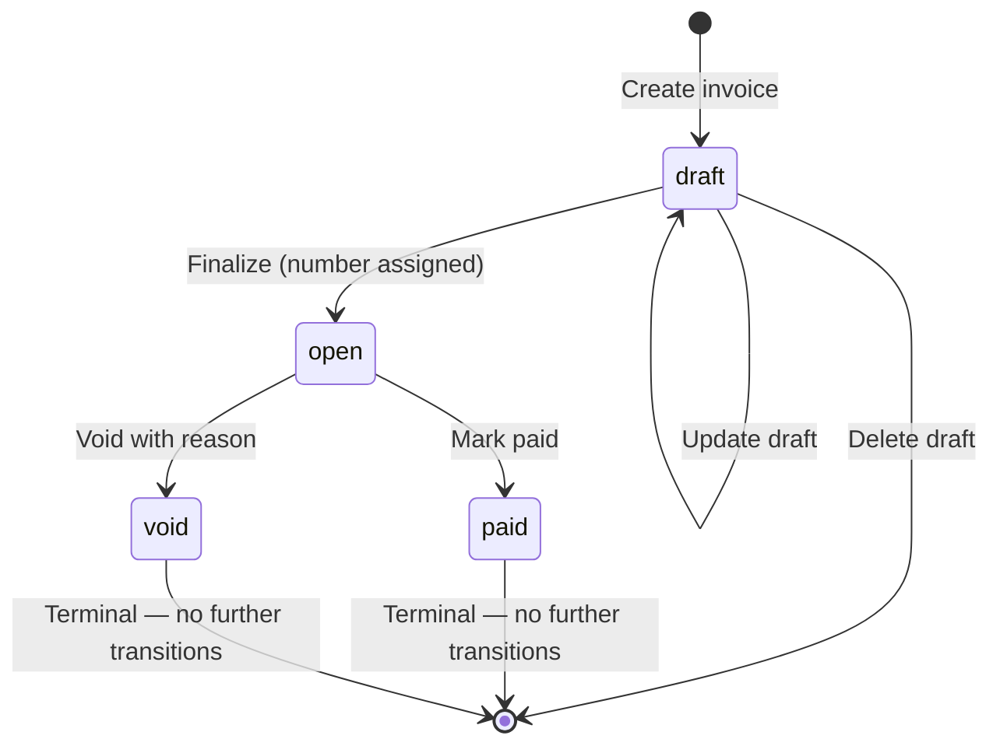

# Invoices: Lifecycle, Status Transitions and Numbering

> Learn how Invoice AI models invoices: status lifecycle, number assignment, frozen snapshots, and how every amount is represented in the API.

An invoice in Invoice AI represents a request for payment sent from your business to a client. Each invoice moves through a defined set of statuses, carries a permanent audit trail, and freezes a snapshot of both parties' details the moment it is finalized.

***

## Invoice object overview

Every invoice has a unique identifier that begins with `in_` (for example, `in_ABcd1234EFgh5678IJkl9012`). This ID is what you use across the API to retrieve, update, finalize, or void an invoice.

### Key fields

| Field              | Type           | Description                                                                                       |
| ------------------ | -------------- | ------------------------------------------------------------------------------------------------- |
| `id`               | string         | Unique invoice ID (`in_…`)                                                                        |
| `number`           | string \| null | Human-readable invoice number. `null` while the invoice is a draft                                |
| `status`           | string         | Current status — see the [Status reference](#status-reference) below                              |
| `customer`         | string         | The associated customer ID (`cus_…`)                                                              |
| `currency`         | string         | ISO 4217 currency code (e.g. `USD`, `GBP`, `INR`)                                                 |
| `issue_date`       | string         | Invoice date in `YYYY-MM-DD` format                                                               |
| `due_date`         | string \| null | Payment due date in `YYYY-MM-DD` format, or `null` if not set                                     |
| `subtotal`         | integer        | Sum of all line amounts before discounts, in minor units                                          |
| `tax`              | integer        | Total tax across all lines, in minor units                                                        |
| `total`            | integer        | Grand total payable, in minor units                                                               |
| `amount_due`       | integer        | Amount still owed. `0` for drafts, paid, and void invoices                                        |
| `amount_in_words`  | string \| null | Total expressed as words (e.g. "Two Thousand Five Hundred Dollars") — useful for formal documents |
| `public_url_token` | string         | Token used to build a shareable client-facing link                                                |
| `lines`            | object         | Contains a `data` array of line items (`ii_…` IDs)                                                |

***

## Money: all amounts are integer minor units

Every monetary amount in the API is an **integer in minor units** — cents for USD/EUR/GBP, paise for INR, and so on. There are no decimal points in amounts.

| Human amount | API value  |
| ------------ | ---------- |
| \$25.00      | `2500`     |
| \$2,500.00   | `250000`   |
| ₹1,00,000.00 | `10000000` |

<Warning>
  Do not send or display raw API amounts directly. Always divide by 100 (or the appropriate minor-unit factor for your currency) before showing them to users.
</Warning>

***

## Status reference

An invoice can be in one of five statuses. Four are stored in the database; one is derived at read time.

| Status    | Stored?   | Meaning                                                                                                                                                       |
| --------- | --------- | ------------------------------------------------------------------------------------------------------------------------------------------------------------- |
| `draft`   | ✅ Yes     | The invoice is being edited. No invoice number has been assigned.                                                                                             |
| `open`    | ✅ Yes     | The invoice is finalized. A number has been assigned and the invoice is awaiting payment.                                                                     |
| `paid`    | ✅ Yes     | The invoice has been marked as paid. `amount_due` returns `0`.                                                                                                |
| `overdue` | ❌ Derived | The invoice is `open` and its `due_date` is in the past (evaluated in UTC). This status is **never stored** — it is computed every time you read the invoice. |
| `void`    | ✅ Yes     | The invoice has been cancelled. The number is retained for audit purposes but the invoice is no longer collectible.                                           |

<Note>
  `overdue` is derived at display time, not written to the database. This means it is always accurate — there is no nightly job that could fall behind or silently stop. An invoice that was open on Tuesday will correctly show as overdue on Wednesday without any background process.
</Note>

<Note>
  An invoice settled after its due date shows as `paid` — not `overdue`. Once an invoice is paid, it stays paid regardless of when payment arrived.
</Note>

***

## Lifecycle and valid transitions

Invoices follow a strict one-way state machine. The diagram below shows every allowed transition.



### What each transition means in practice

* **Create → draft**: The invoice is created with all its line items but no number. You can edit it freely.
* **Draft → open (finalize)**: The invoice number is assigned from your configured sequence. Business and client details are frozen into a snapshot at this point (see [Snapshots](#snapshots-frozen-details)).
* **Open → paid**: You record that payment has been received. The `paid_at` timestamp is set.
* **Open → void**: You cancel the invoice and provide a reason. The `void_reason` and `voided_at` fields are set. The invoice number is **kept** on the record so your number sequence has no unexplained gaps.
* **Deleting**: You can only delete a `draft`. A finalized invoice cannot be deleted — use `void` instead.

<Warning>
  You cannot move an invoice backward. A finalized invoice cannot return to `draft`, and a paid invoice cannot be voided (use a credit note instead). These restrictions protect the integrity of your invoice sequence.
</Warning>

***

## Invoice numbering

Invoice numbers are assigned **only when you finalize** an invoice. A draft has `number: null` until that point.

The default format is:

```
<PREFIX>/<FINANCIAL_YEAR>/<SEQUENCE>
```

For example: **`INV/25-26/0001`**

* **Prefix** — Configured in your business settings. Can contain letters, numbers, hyphens, and slashes (e.g. `INV`, `ACME/INV`). Maximum 16 characters.
* **Financial year** — Derived from your invoice date (e.g. `25-26` for the 2025–2026 financial year).
* **Sequence** — A zero-padded counter that increments with each finalized invoice. You control the starting number in your settings.

Number assignment uses a database-level lock so two invoices finalized at the same time cannot receive the same number. The operation is also retry-safe: finalizing an already-finalized invoice returns its existing number rather than assigning a new one.

<Tip>
  You can customize your prefix and starting sequence number in **Settings → Numbering**. Changes only affect future invoices — numbers already assigned are permanent.
</Tip>

***

## Snapshots: frozen details

When you finalize an invoice, Invoice AI captures a **snapshot** of your business details and your client's details at that exact moment. These snapshots are stored permanently with the invoice.

This means:

* If you update your business address later, old invoices still show the address that was correct when they were issued.
* If a client changes their name or email, their prior invoices remain accurate.
* The PDF generated from a finalized invoice always matches what the client was sent, no matter how much time has passed.

<Note>
  Snapshots are automatic — you don't need to do anything. Every time you finalize an invoice, the current state of your business profile and client record is captured and locked to that invoice.
</Note>

***

## Tax computation

Tax on each line item is a **free-form percentage** (`tax_rate`). There is no fixed tax code lookup. You enter the rate you need — whether that is VAT, GST, sales tax, or any other levy.

**The server always recomputes all totals.** Any subtotals, tax amounts, or grand totals you send in an API request are ignored. Invoice AI calculates them from your line items. This guarantees that a document's tax always matches its own lines — it cannot be manipulated client-side.

***

## Shareable public link

Every invoice has a `public_url_token`. You can construct a client-facing, no-login-required link with this token. The link lets your client view and download the invoice without needing an Invoice AI account.

The token is assigned when the invoice is created and does not change when you finalize, pay, or void the invoice.

***

## Line items

Each line item on an invoice has its own ID prefixed with `ii_`. Line items record:

| Field              | Description                                                                                                                        |
| ------------------ | ---------------------------------------------------------------------------------------------------------------------------------- |
| `description`      | What you are billing for                                                                                                           |
| `quantity`         | How many units                                                                                                                     |
| `unit`             | Unit of measure. Accepted values: `NOS`, `PCS`, `KGS`, `GMS`, `LTR`, `MTR`, `SQF`, `SQM`, `HRS`, `DAY`, `MON`, `BOX`, `SET`, `OTH` |
| `unit_amount`      | Rate per unit, in minor units                                                                                                      |
| `discount_percent` | Line-level discount (0–100)                                                                                                        |
| `tax_rate`         | Tax percentage applied to this line                                                                                                |
| `amount`           | Line total after quantity, discount and tax, in minor units                                                                        |
| `price`            | Catalog price ID (`price_…`) if the line came from your catalog, or `null` for ad-hoc lines                                        |
| `product`          | Catalog product ID (`prod_…`) if linked, or `null`                                                                                 |

A line item can be **catalog-linked** (referencing a `price_…` ID from your product catalog) or **ad-hoc** (all values entered directly on the invoice). Both types appear identically in the finalized invoice.
