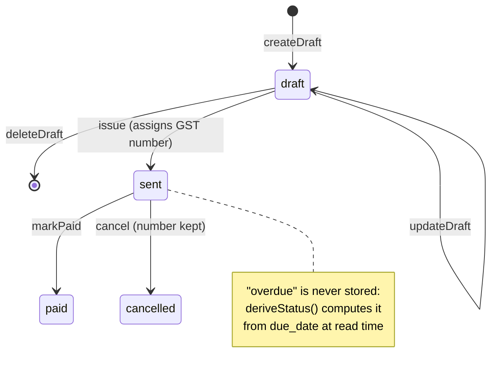

# 00 · Foundation: one kitchen for every door

> **Depends on:** nothing. This is the first module.
> **Needed by:** everything. [01-api.md](01-api.md) wraps these functions in HTTP; [02-sdk.md](02-sdk.md), [03-cli.md](03-cli.md) and [04-mcp.md](04-mcp.md) reach them through the API.

## 1. What this layer is, and what students learn

A bank teller's rules ("you can't withdraw more than your balance") don't change depending on whether you walk into the branch, use the ATM or phone the call centre. If each channel had its *own* copy of the rules, one of them would eventually get them wrong.

Invoice-AI is about to get four new channels (API, SDK, CLI, MCP). This module makes sure they all share **one copy of the rules**: a **service layer**.

Students leave this module understanding:

1. **Separation of concerns.** *What the business does* (issue an invoice) is separate from *who is asking and how* (a browser cookie, an API key, an AI assistant).
2. **Passing identity in instead of reaching for it.** A service function receives an `AuthContext` rather than reading cookies itself.
3. **Transactions as correctness.** Some bugs only appear when two things happen at the same moment. A database transaction is how you make "claim a number and mark the invoice issued" a single step.
4. **Why "build the API first" is the wrong first step** for this codebase.

## 2. How it works in this repo today

All business logic lives in Next.js **server actions** under `lib/actions/`. They work well for the web UI, but they are welded to it:

| Coupling | Where | Why an API can't reuse it |
|---|---|---|
| `requireUser()` **redirects** to `/login` when signed out | `lib/queries.ts` | An API caller needs a `401` JSON error, not an HTML redirect |
| Queries are wrapped in React `cache()` | `lib/queries.ts` (`getCurrentUser`, `getProfile`, `getPrimaryBusiness`) | Only meaningful inside a React server render |
| The Supabase client is built from **browser cookies** | `lib/supabase/server.ts` | API keys and OAuth tokens arrive in an `Authorization` header |
| Form actions take `FormData` | `lib/actions/business.ts` (`persistBusiness`, `persistPayment`, `persistNumbering`), `lib/actions/onboarding.ts` | Programs send JSON |
| `revalidatePath()` after writes | `lib/actions/invoice.ts`, `lib/actions/send.ts` | A page-cache concern, irrelevant to an API |
| The proxy redirects every non-public path | `lib/supabase/proxy.ts` (`PUBLIC_PREFIXES` = `/i/`, `/api/public/`, …) | `/api/v1/*` would be redirected before reaching a handler |

**What's already good and reusable as-is:**
- `lib/validators.ts`: zod schemas (`invoiceSchema`, `lineItemSchema`, …)
- `lib/gst.ts#computeInvoice`: the GST engine (CGST/SGST vs IGST, rounding in paise)
- `lib/invoice-load.ts#viewFromRows`: turns rows into the view shared by web, public page and PDF
- `lib/invoice-status.ts#deriveStatus`: overdue is calculated, not stored
- `lib/pdf.tsx#renderInvoicePdf` and `lib/email.tsx#sendInvoiceEmail`
- **RLS on every table** (`owner_id = auth.uid()`, `supabase/migrations/0001_init.sql`), so tenant isolation is already enforced by the database

**What's missing entirely:**
- cancelling an invoice (`cancelled` exists in the enum but is never written)
- deleting a draft
- listing invoices (the dashboard runs its own query inline in `app/(app)/dashboard/page.tsx`)
- managing clients (a `clients` row is created only as a side effect of saving an invoice)

**Show the students:** open `lib/actions/send.ts` and point at three different concerns in one function:
1. who is the user (`requireUser`)
2. the business rule (claim a number, mark it sent)
3. the web page cache (`revalidatePath`)

Then ask: *"Which of these would an AI assistant calling us need?"* Only #2.

## 3. Design

### 3.1 `AuthContext`: who is asking (new: `lib/auth/context.ts`)

```ts
export type AuthVia = 'session' | 'api_key' | 'oauth'

export type AuthContext = {
  userId: string
  supabase: SupabaseClient<Database>   // already authenticated AS this user, so RLS applies
  via: AuthVia
  scopes: ReadonlySet<Scope>           // session = all scopes; keys/OAuth = what was granted
  apiKeyId?: string
  clientId?: string                    // OAuth client (e.g. Claude)
  requestId: string
}

export async function contextFromSession(): Promise<AuthContext>   // for pages and server actions
export function requireScope(ctx: AuthContext, scope: Scope): void  // throws ServiceError('forbidden')
```

[01-api.md](01-api.md) adds `contextFromApiKey()` and `contextFromOAuth()`. Every service function accepts the context without caring which one built it.

### 3.2 A Supabase client from a token (new: `lib/supabase/for-token.ts`)

```ts
export function createTokenClient(accessToken: string): SupabaseClient<Database>
// publishable key as `apikey`, `Authorization: Bearer <accessToken>`, no cookies, no session persistence
```

This is what lets an API key or OAuth token run under the **same RLS policies** as a browser session. The Supabase secret (service_role) key is **never** used for tenant data, because it bypasses RLS.

### 3.3 One error type (new: `lib/services/errors.ts`)

```ts
export class ServiceError extends Error {
  constructor(
    readonly code: 'validation' | 'not_found' | 'invalid_state' | 'conflict' | 'forbidden' | 'upstream_failed',
    message: string,
    readonly details?: { path: string; message: string }[],
  ) { super(message) }
}
```

- **Server actions** map it to `{ error }` for the existing UI.
- **The API** maps it to problem+json status codes (see 01).
- **MCP** maps it to a sentence the model can act on (see 04).

### 3.4 Service functions

Every function takes `ctx` first, validates with the existing zod schemas, returns typed data, and throws `ServiceError`. None of them call `redirect`, `revalidatePath` or `cookies()`.

**`lib/services/invoices.ts` (new)**

| Function | Rule it enforces | Replaces / reuses |
|---|---|---|
| `createDraft(ctx, input)` | Validates with `invoiceSchema`, recomputes totals with `computeInvoice`, writes the `created` event | `saveInvoiceDraft` (new-invoice path) |
| `updateDraft(ctx, id, input)` | Drafts only; items replaced **atomically** | `saveInvoiceDraft` (edit path) |
| `deleteDraft(ctx, id)` | Drafts only; issued invoices can never be deleted | new |
| `issue(ctx, id)` → `{ invoiceNumber }` | Calls the atomic `issue_invoice` RPC; returns the existing number if already issued | first half of `sendInvoiceAction` |
| `send(ctx, id, { to? })` → `{ emailed, publicUrl }` | Must be issued; renders PDF, emails, writes `emailed` or `email_failed` | second half of `sendInvoiceAction`, `renderInvoicePdf`, `sendInvoiceEmail` |
| `markPaid(ctx, id, { paidOn?, reference? })` | Only `sent` invoices; exactly one row must change | `markPaidAction` |
| `cancel(ctx, id, { reason })` | Only `sent` invoices; keeps the number, records the reason | new |
| `list(ctx, { status?, clientId?, from?, to?, cursor?, limit })` | Cursor pagination; status derived with `deriveStatus` | inline query in `app/(app)/dashboard/page.tsx` |
| `get(ctx, id)` → `InvoiceView` | — | edit page query + `viewFromRows` |
| `pdf(ctx, id)` → `Buffer` | — | `app/api/invoices/[id]/pdf/route.ts` + `renderInvoicePdf` |
| `events(ctx, id)` | — | new |

**`lib/services/clients.ts` (new):** `list(ctx, { query?, cursor?, limit })`, `get`, `create`, `update`, `archive`. Archive, not delete, because issued invoices reference clients.

**`lib/services/business.ts` (new):** `getPrimary(ctx)` (same "oldest business" rule as `getPrimaryBusiness`) and `update(ctx, input)`. The `FormData` parsing moves out into the action.

### 3.5 The invoice state machine



The database enum is named `sent` for historical reasons. Its meaning is **issued**: it has a number, and the email may or may not have gone out. The API and webhooks call this transition `invoice.issued` and use `invoice.emailed` for the email, so integrators aren't confused.

### 3.6 Bugs that must be fixed first

All six are real on `main` today. Each one becomes more dangerous once programs and AI agents, which retry and run in parallel, can trigger it.

| # | Bug | Where | Why it matters for a platform | Fix |
|---|---|---|---|---|
| 1 | **Send race burns GST numbers.** `claim_invoice_number` runs when the invoice has no number, then a *separate* UPDATE filtered only by `id` + `owner_id` saves it. Two concurrent sends both claim a number, the second overwrites the first, and a number is lost | `lib/actions/send.ts#sendInvoiceAction` | GST requires a consecutive series; a retrying SDK or agent makes concurrency normal | Atomic `issue_invoice` RPC (3.7) |
| 2 | **Line items aren't saved atomically.** Items are deleted (error ignored), then re-inserted in a second call. A failure in between leaves a draft with no items | `lib/actions/invoice.ts#saveInvoiceDraft` | API clients will hit transient failures | `replace_invoice_items` RPC in one transaction |
| 3 | **Mark-paid can't fail and allows cancelled → paid.** It filters only `status <> 'draft'`, doesn't check that a row changed, and writes a `paid` event regardless | `lib/actions/send.ts#markPaidAction` | An API would report success for a wrong id and fire a false `invoice.paid` webhook | `status = 'sent'` filter + require exactly one updated row |
| 4 | **A `sent` event is written on every call**, including re-sends | `lib/actions/send.ts#sendInvoiceAction` | Webhooks would announce the same invoice being "issued" repeatedly | `issue` writes once; `send` writes `emailed` / `email_failed` |
| 5 | **The `created` event is never written** | `lib/actions/invoice.ts#saveInvoiceDraft` | No `invoice.created` webhook is possible | `createDraft` writes it |
| 6 | **Overdue depends on the server's timezone.** `isPastDue` uses the process timezone; Vercel runs in UTC, so between 00:00 and 05:30 IST yesterday's invoices aren't overdue | `lib/invoice-status.ts` (caught by CI in PR #1) | `list` will expose derived status over the API | Compute "today" in India time (being fixed in PR #1) |

**Show the students:** reproduce bug #1 before fixing it.
1. Create a draft.
2. Fire two `sendInvoiceAction` calls at once with `Promise.all`, from a test or two browser tabs clicking together.
3. Show the business's `next_invoice_number` jumped by 2 while the invoice holds only one number.

Then explain why a transaction with a row lock makes this impossible.

### 3.7 Migration `supabase/migrations/0004_foundation.sql` (new)

**Atomic issue** (sketch; final SQL written at build time):

```sql
create or replace function public.issue_invoice(p_invoice_id uuid)
returns text
language plpgsql
security definer
set search_path = public
as $$
declare
  v_invoice public.invoices%rowtype;
  v_number  text;
begin
  -- Lock this invoice row: a second concurrent call waits here instead of racing.
  select * into v_invoice
    from public.invoices
   where id = p_invoice_id and owner_id = auth.uid()
     for update;

  if not found then
    raise exception 'not_found' using errcode = 'P0002';
  end if;

  -- Already issued: return the same number (database-level idempotency).
  if v_invoice.invoice_number is not null then
    return v_invoice.invoice_number;
  end if;

  if v_invoice.status <> 'draft' then
    raise exception 'invalid_state' using errcode = 'P0001';
  end if;

  v_number := public.claim_invoice_number(v_invoice.business_id);  -- same transaction

  update public.invoices
     set invoice_number = v_number, status = 'sent', sent_at = now()
   where id = p_invoice_id;

  insert into public.invoice_events (invoice_id, type) values (p_invoice_id, 'sent');

  return v_number;
end;
$$;

revoke execute on function public.issue_invoice(uuid) from public, anon;
grant  execute on function public.issue_invoice(uuid) to authenticated;
```

- `claim_invoice_number` already checks `owner_id = auth.uid()` and increments under a row lock. Calling it inside `issue_invoice` means "claim" and "save" either **both** happen or **neither** does.
- The `revoke … from anon` line follows the lesson already recorded in `0002_lock_down_functions.sql`: Supabase's default privileges would otherwise grant new functions to `anon`.

**Also in 0004:**

| Change | Purpose |
|---|---|
| `replace_invoice_items(p_invoice_id uuid, p_items jsonb)`, SECURITY DEFINER, drafts only, one transaction | Fix bug #2 |
| Enum `invoice_event_type` add `cancelled`, `updated`, `emailed`, `email_failed` | Events for cancel, edits and email outcome (webhooks in 01) |
| `invoices.cancelled_at timestamptz`, `invoices.cancel_reason text` | Cancellation record |
| `clients.archived_at timestamptz` | Archive instead of delete |
| Start writing `invoice_events.meta` (column exists, unused today) as `{ actor: 'session'\|'api_key'\|'oauth', api_key_id?, client_id?, request_id }` | "Who did this?" for every change |
| Update `log_public_invoice_event` to skip **cancelled** invoices too (today it skips only drafts) | Keep events consistent with `get_public_invoice`, which already hides cancelled invoices |

### 3.8 Server actions become thin adapters

Before and after for the smallest example:

```ts
// BEFORE: lib/actions/send.ts (today, simplified)
export async function markPaidAction(invoiceId: string) {
  const user = await requireUser()
  const supabase = await createClient()
  await supabase.from('invoices').update({ status: 'paid', paid_at: … })
    .eq('id', invoiceId).eq('owner_id', user.id).neq('status', 'draft')
  await supabase.from('invoice_events').insert({ invoice_id: invoiceId, type: 'paid' })
  revalidatePath('/dashboard')
  return {}
}

// AFTER: same file, same UI contract
export async function markPaidAction(invoiceId: string) {
  try {
    await invoices.markPaid(await contextFromSession(), invoiceId, {})
  } catch (err) {
    return { error: toActionError(err) }        // ServiceError → friendly message
  }
  revalidatePath('/dashboard')                  // page-cache concern stays in the adapter
  return {}
}
```

**The UI doesn't change at all.** Components keep calling the same actions with the same return shapes (`SendState` in `lib/send-state.ts`, `StepState` in `lib/form-state.ts`).

### 3.9 Testing

- **Unit (Vitest, `lib/**/*.test.ts`, already in CI):**
  - service functions with a mocked `AuthContext.supabase`
  - state-machine rules: can't update an issued invoice, can't mark a draft paid, can't cancel a paid invoice
- **Database (against local Supabase, `supabase start`):**
  - two concurrent `issue_invoice` calls produce **one** number and `next_invoice_number` advances by **one**
  - `markPaid` on a cancelled invoice fails
  - `replace_invoice_items` failing mid-way leaves the old items intact
- **Regression:** the existing smoke test (`.github/scripts/smoke-test.sh`) and a manual run of every UI flow (create, edit, send, public link, PDF).

## 4. Build phases

| Phase | Scope | Acceptance criteria | Teaching checkpoint |
|---|---|---|---|
| **F1: Migration + bug fixes** | `0004_foundation.sql`; fix bugs #1–#5 inside the *existing* actions; #6 lands via PR #1 | Concurrent-issue test gives one number. Mark-paid on cancelled or unknown id returns an error and writes no event. All existing Vitest tests pass | Students reproduce the race *before* the fix, then run the same script after |
| **F2: Services + actions rewired** | `lib/auth/context.ts`, `lib/supabase/for-token.ts`, `lib/services/{errors,invoices,clients,business}.ts`; every action becomes an adapter | `grep -r "supabase.from" lib/actions` returns nothing. Smoke test and UI flows unchanged | Draw the kitchen/waiters diagram from [README.md](README.md) on the whiteboard, with real file names |
| **F3: Missing operations** | `cancel`, `deleteDraft`, `list`, `events`, client CRUD; add Cancel and Delete-draft buttons to the invoice page; dashboard uses `invoices.list` | A cancelled invoice keeps its number, shows "Cancelled" on the public link, and can't be paid. The dashboard lists via the service | "Why can't we just delete an issued invoice?" (GST numbering) |

## 5. Security and abuse

- **RLS remains the only tenant boundary.** Services always use a user-scoped Supabase client (session cookie, minted JWT or OAuth token); the secret key is never used for tenant data.
- **SECURITY DEFINER functions** (`issue_invoice`, `replace_invoice_items`) must:
  - re-check `owner_id = auth.uid()`
  - pin `search_path = public`
  - revoke `execute` from `anon`, as `0002_lock_down_functions.sql` already does
- **`requireScope` is called inside services, not only at the API edge**, so a future caller that forgets the check still can't exceed its scopes.
- **Anonymous (guest) sessions** keep working in the web UI via `contextFromSession`, but the credential features in 01 refuse anonymous users.
- **Events carry `meta.actor`**, which gives an audit trail for "an AI assistant cancelled this invoice" before the full API audit log exists.

## 6. Open decisions

- **Financial-year counter reset.** `claim_invoice_number` builds `PREFIX/YY-YY/0001` from `businesses.next_invoice_number`, which **never resets**: the first invoice of FY 27-28 would be `…/27-28/0458`. Many businesses restart at `0001` each April. Decide before the API makes numbering visible to integrators.
- **GST Rule 46 length limit.** An invoice number can be at most **16 characters**. `/YY-YY/0001` uses 11, so `invoice_prefix` must be ≤ 5 characters. Add a check constraint, or change the format.
- **Cancelling a paid invoice.** In GST terms this needs a credit note, not a status flip. Out of scope for v1 (cancel is `sent` only).
- **Archived clients:** hidden from `clients.list` by default, with `?include_archived=true`?
- **Multiple businesses:** the schema allows several per owner, but the app uses the oldest. Keep "primary business only" for v1 of the platform.

> ### How the MCP story uses this layer
> When Claude runs "invoice Acme ₹25,000 and email it", the calls land here as `clients.list` → `invoices.createDraft` → `invoices.issue` → `invoices.send`. These are **the exact functions the web UI uses**, so an AI assistant can't produce a different GST total than the builder shows, can't skip a validation, and, because of the `issue_invoice` RPC, can't burn two invoice numbers even if it retries.

## 7. Five-minute demo order

1. Open `lib/actions/send.ts` and label the three concerns on screen: identity, business rule, page cache.
2. Run the concurrent-send script and show the invoice-number gap. *"A retrying AI agent would do this to you on day one."*
3. Show `issue_invoice` and point at `for update`. *"The second caller waits in line."*
4. Re-run the script: one number.
5. Show `markPaidAction` before and after: five lines of rules become one service call. *"The web UI didn't change, and now four more doors can use the same kitchen."*
