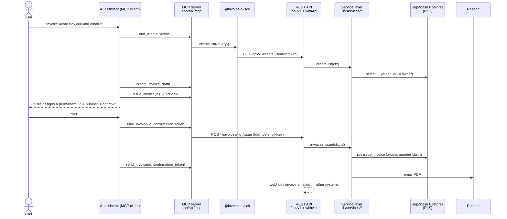
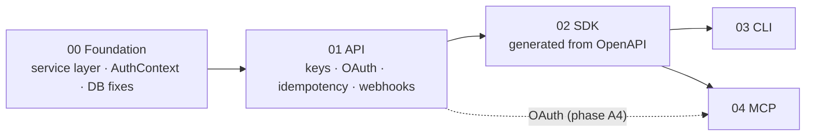

# Invoice-AI as a platform

Today Invoice-AI is a **closed app**: the only way to create a GST invoice is to open the website and click through the builder. This folder plans how to make it a **platform**, where other programs, scripts and AI assistants can safely do the same work.

These are **planning documents, not code**. Each one explains the concept first, grounds it in this repo's real files, and ends with build phases you can pick up later.

## The north-star story

Every document is designed around one sentence a user says to an AI assistant:

> **"Claude, invoice Acme ₹25,000 for September consulting and email it."**

If the platform can do that *safely*, it can do almost anything else an integrator needs. "Safely" means:
- the right GST split
- one invoice number, never two
- a human confirming before a legal document is issued
- no access to anyone else's data

## The one idea: one kitchen, many waiters

A restaurant has one kitchen and many ways to order: a waiter at the table, a phone order, a delivery app. The recipes don't change with the way you ordered. If the phone line had its own kitchen, the food would taste different depending on how you called.

| Waiter (interface) | Who uses it | Doc |
|---|---|---|
| Web UI (exists today) | A business owner in the browser | — |
| REST API | Any program that speaks HTTP | [01-api.md](01-api.md) |
| SDK | TypeScript developers | [02-sdk.md](02-sdk.md) |
| CLI | Developers, scripts, CI jobs | [03-cli.md](03-cli.md) |
| MCP server | AI assistants (Claude, ChatGPT, Cursor) | [04-mcp.md](04-mcp.md) |
| **The kitchen: service layer** | **Every waiter above** | [00-foundation.md](00-foundation.md) |

**Show the students:** open `lib/actions/send.ts`. The "kitchen" (claim an invoice number, render a PDF, email it) is mixed up with one specific waiter (a Next.js server action reading the browser's cookies). Module 0 separates them.

## The north-star request, end to end

## The five modules, in order

| # | Module | The one concept students must leave with | Depends on |
|---|---|---|---|
| 00 | Foundation | Separate *what the business does* from *who is asking and how* | — |
| 01 | API | A contract + two kinds of identity (what vs who) + retries that can't double-charge | 00 |
| 02 | SDK | Generate clients from the contract, so they can't drift | 01 |
| 03 | CLI | Developer experience: login, credential storage, `--json`, exit codes | 02 |
| 04 | MCP | Designing tools for a language model, with a human in the loop | 02 (+ OAuth from 01) |

### Why this order, and not "API → CLI → SDK → MCP"

1. **The foundation isn't the API.** Business logic lives in `'use server'` actions that call `requireUser()` (which *redirects* to `/login`) and read cookies. An HTTP API can't reuse that without copying it, so the real first step is a service layer.
2. **SDK before CLI.** A CLI is an SDK with a terminal on top. Build the CLI on raw HTTP first and you rewrite it later.
3. **MCP doesn't need the CLI.** Both are thin layers over the SDK, so they can be built in parallel.
4. **API keys and OAuth solve different problems.** An API key says *which program* is calling. OAuth says *which user agreed* to let a third-party app act for them. You need keys for your own scripts, and OAuth for other companies' apps and remote AI assistants.
5. **Webhooks are half of composability.** Without events like `invoice.paid`, integrators have to poll.
6. **GST law makes idempotency mandatory.** Invoice numbers must be consecutive and unique per financial year. A retried "issue" that burns a second number is a compliance problem, not just a bug.

## What v1 includes, and what it deliberately doesn't

| In v1 | Not in v1 (and why) |
|---|---|
| Business profile (read) | Business settings writes: onboarding is a UI flow |
| Clients: list, get, create, update, archive | AI parse / transcribe: costs OpenAI money per call |
| Invoices: drafts, issue, send, mark paid, cancel, PDF, events | GSTIN lookup: paid third-party quota (sandbox.co.in) |
| Webhook endpoints | Organisations / team members: product stays single-owner |
| API keys + OAuth for third-party apps | Guest (anonymous) accounts getting credentials |

## Glossary

| Term | Plain meaning in this project |
|---|---|
| **RLS** (Row Level Security) | Postgres rules like `owner_id = auth.uid()` on every table, so a query can only ever see its owner's rows |
| **JWT** | A signed token saying "this is user X, valid until Y". Supabase reads it to fill in `auth.uid()` |
| **Service layer** | Plain functions (`invoices.issue(ctx, id)`) that hold the business rules, called by every interface |
| **AuthContext** | The "who is asking" object passed into every service function: user, how they authenticated, allowed scopes |
| **Scope** | A permission slice such as `invoices:send`. A credential only gets the scopes it was granted |
| **API key** | A long secret string a program sends in `Authorization: Bearer …`. Identifies a credential we issued |
| **OAuth 2.1** | The "Sign in with… / Allow this app to…" flow. The user approves an app, and the app gets a token for them |
| **PKCE** | The OAuth safety step for apps that can't keep a secret (CLIs, desktop AI apps) |
| **Idempotency key** | A unique id sent with a request so a retry returns the first result instead of doing the work twice |
| **problem+json** | A standard JSON shape for API errors (RFC 9457) |
| **OpenAPI** | A machine-readable description of the API that SDKs and docs are generated from |
| **Webhook** | An HTTP request *we* send to *your* server when something happens (`invoice.paid`) |
| **Outbox** | Saving "an event happened" in the same database transaction as the change, then delivering it separately |
| **HMAC signature** | A hash made with a shared secret, so a webhook receiver can prove the request really came from us |
| **MCP** | Model Context Protocol, the standard way an AI assistant discovers and calls tools |

## Branch policy

- **Platform work happens on `platform/*` branches, after the `stage-1…4` course branches are merged into `main`.** The SDK, CLI and MCP packages need `packages: ['packages/*']` in `pnpm-workspace.yaml` plus new dependencies, and both change the lockfile. Doing that mid-course would conflict with every stage merge.
- **New packages go *alongside* the Next.js app** (`packages/sdk`, `packages/cli`, `packages/mcp-tools`). The app is never moved into `apps/`.
- **Every platform PR goes through the existing CI/CD pipeline** (`.github/workflows/`). OpenAPI drift and SDK type checks are added to CI in module 02.

## Things to verify at build time

These came up during planning and are **not yet confirmed**. Each doc repeats the ones relevant to it.

- **Supabase signing keys:** does Supabase accept JWTs signed by an imported key while it's still on *standby*, or must it be rotated to active first? Once active, it signs every session, which makes it the root secret. (01)
- **Supabase OAuth 2.1 server:** check its current release status, the exact consent-page APIs, and whether loopback redirects accept any port (RFC 8252). (01, 03, 04)
- **Vercel plan tier:** per-minute Cron (webhook retries) and the Rate Limiting SDK. (01)
- **GST Rule 46:** invoice numbers are at most 16 characters, and the current format `PREFIX/YY-YY/0001` leaves at most 5 for the prefix. Also decide whether the counter resets each financial year. (00)

## A suggested teaching path (5 sessions)

1. **Foundation:** refactor one action (`markPaidAction`) into a service live, and show the bug it had.
2. **API:** create an API key in settings, `curl` your own invoices, then retry an issue with the same `Idempotency-Key`.
3. **SDK:** change a zod schema and watch the generated SDK types break in the editor.
4. **CLI:** `invoice-ai login`, then `invoice-ai invoices list --json | jq`.
5. **MCP:** connect Claude to the MCP server and run the north-star sentence, including the confirmation step.

## Five-minute demo order (intro session)

1. Open the live app, create and send an invoice in the UI. *"This is the only door today."*
2. Open `lib/actions/send.ts`. *"The kitchen and the waiter are the same code."*
3. Show the kitchen/waiters table above. *"We're going to build four new doors to one kitchen."*
4. Read the north-star sentence aloud and trace it through the sequence diagram.
5. Point at the order graph. *"Foundation first. Here's why."*
