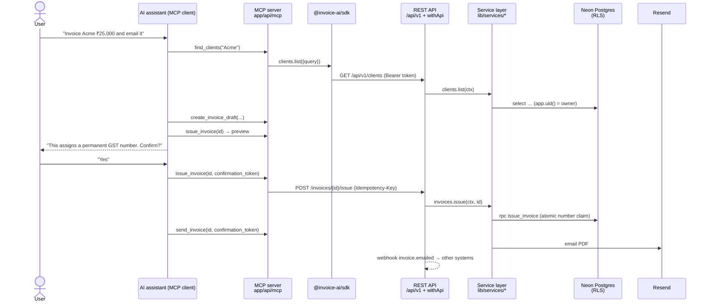
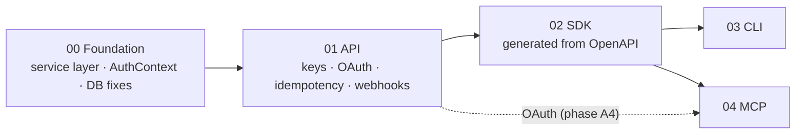

# Invoice-AI as a platform

Today Invoice-AI is a **closed app**: the only way to create a GST invoice is to open the website and click through the builder. This folder plans how to make it a **platform**, where other programs, scripts and AI assistants can safely do the same work.

These are **planning documents, not code**. Each one explains the concept first, grounds it in this repo's real files, and ends with build phases you can pick up later.

## Where this stands (Oct 2026)

Most of the plan has been built. Each module doc opens with a status note; the short version:

| Module | Status |
|---|---|
| 00 Foundation | Built: `lib/auth/context.ts`, `lib/services/*`, atomic `issue_invoice()` |
| 01 API | Built: keys, scopes, idempotency, webhooks, rate limits, audit, OAuth 2.1 (`lib/oauth/`, `0016_oauth.sql`) |
| 02 SDK | Built in [navdeepyadav19/invoice-ai-sdk](https://github.com/navdeepyadav19/invoice-ai-sdk): TypeScript and Python, generated from `api-docs/openapi.json`. Publishing pending |
| 03 CLI | Built in the same repo (`invoice-ai`, browser device login). The server half is here: `app/api/cli/`, `lib/cli-auth/` |
| 04 MCP | Built: remote server at `/mcp` (`app/mcp/route.ts`, `lib/mcp/`), 16 tools, OAuth or API key, server-enforced confirmations. Docs: [docs.horizonpay.co/mcp/overview](https://docs.horizonpay.co/mcp/overview) |

Two decisions taken after this was written change the vocabulary throughout:

- **Worldwide, not India-only** (`db/migrations/0009_global_breaking.sql`): any country and currency, a free-form tax rate per line (`lib/tax.ts`), numbering `PREFIX-0001`. The GST examples below (CGST/SGST/IGST, GSTIN, `INV/26-27/0042`, paise) are from the original plan.
- **Stripe-shaped API** (`0011_stripe_api.sql`): `customers`, `products`, `prices`, `invoice-items`; invoices go `draft → open → paid` or `void` through `finalize` / `pay` / `void`; amounts are integer minor units.

For using the API today, start with [api-getting-started.md](api-getting-started.md) or the developer docs in `api-docs/`.

## The north-star story

Every document is designed around one sentence a user says to an AI assistant:

> **"Claude, invoice Acme ₹25,000 for September consulting and email it."**

If the platform can do that *safely*, it can do almost anything else an integrator needs. "Safely" means:
- the right tax on every line
- one invoice number, never two
- a human confirming before a legal document is issued
- no access to anyone else's data

## The one idea: one kitchen, many waiters

A restaurant has one kitchen and many ways to order: a waiter at the table, a phone order, a delivery app. The recipes don't change with the way you ordered. If the phone line had its own kitchen, the food would taste different depending on how you called.

| Waiter (interface) | Who uses it | Doc |
|---|---|---|
| Web UI (exists today) | A business owner in the browser | — |
| REST API | Any program that speaks HTTP | [01-api.md](01-api.md) |
| SDK | TypeScript developers | [02-sdk.md](02-sdk.md) |
| CLI | Developers, scripts, CI jobs | [03-cli.md](03-cli.md) |
| MCP server | AI assistants (Claude, ChatGPT, Cursor) | [04-mcp.md](04-mcp.md) |
| **The kitchen: service layer** | **Every waiter above** | [00-foundation.md](00-foundation.md) |

**Show the students:** open `lib/actions/send.ts`. The "kitchen" (claim an invoice number, render a PDF, email it) is mixed up with one specific waiter (a Next.js server action reading the browser's cookies). Module 0 separates them. (That's the pre-foundation code; today `send.ts` is a thin adapter over `lib/services/invoices.ts`, so show the "before" from git history.)

## The north-star request, end to end

```mermaid
sequenceDiagram
    actor User
    participant Claude as AI assistant (MCP client)
    participant MCP as MCP server<br/>app/api/mcp
    participant SDK as @invoice-ai/sdk
    participant API as REST API<br/>/api/v1 + withApi
    participant Svc as Service layer<br/>lib/services/*
    participant DB as Neon Postgres<br/>(RLS)
    participant Mail as Resend

    User->>Claude: "Invoice Acme ₹25,000 and email it"
    Claude->>MCP: find_clients("Acme")
    MCP->>SDK: clients.list({query})
    SDK->>API: GET /api/v1/clients (Bearer token)
    API->>Svc: clients.list(ctx)
    Svc->>DB: select … (app.uid() = owner)
    Claude->>MCP: create_invoice_draft(...)
    Claude->>MCP: issue_invoice(id) → preview
    Claude-->>User: "This assigns a permanent GST number. Confirm?"
    User->>Claude: "Yes"
    Claude->>MCP: issue_invoice(id, confirmation_token)
    MCP->>API: POST /invoices/{id}/issue (Idempotency-Key)
    API->>Svc: invoices.issue(ctx, id)
    Svc->>DB: rpc issue_invoice (atomic number claim)
    Claude->>MCP: send_invoice(id, confirmation_token)
    Svc->>Mail: email PDF
    API-->>API: webhook invoice.emailed → other systems
```

## The five modules, in order

```mermaid
flowchart LR
    F["00 Foundation<br/>service layer · AuthContext · DB fixes"] --> A["01 API<br/>keys · OAuth · idempotency · webhooks"]
    A --> S["02 SDK<br/>generated from OpenAPI"]
    S --> C["03 CLI"]
    S --> M["04 MCP"]
    A -. "OAuth (phase A4)" .-> M
```

| # | Module | The one concept students must leave with | Depends on |
|---|---|---|---|
| 00 | Foundation | Separate *what the business does* from *who is asking and how* | — |
| 01 | API | A contract + two kinds of identity (what vs who) + retries that can't double-charge | 00 |
| 02 | SDK | Generate clients from the contract, so they can't drift | 01 |
| 03 | CLI | Developer experience: login, credential storage, `--json`, exit codes | 02 |
| 04 | MCP | Designing tools for a language model, with a human in the loop | 02 (+ OAuth from 01) |

### Why this order, and not "API → CLI → SDK → MCP"

1. **The foundation isn't the API.** Business logic lives in `'use server'` actions that call `requireUser()` (which *redirects* to `/login`) and read cookies. An HTTP API can't reuse that without copying it, so the real first step is a service layer.
2. **SDK before CLI.** A CLI is an SDK with a terminal on top. Build the CLI on raw HTTP first and you rewrite it later.
3. **MCP doesn't need the CLI.** Both are thin layers over the SDK, so they can be built in parallel.
4. **API keys and OAuth solve different problems.** An API key says *which program* is calling. OAuth says *which user agreed* to let a third-party app act for them. You need keys for your own scripts, and OAuth for other companies' apps and remote AI assistants.
5. **Webhooks are half of composability.** Without events like `invoice.paid`, integrators have to poll.
6. **GST law makes idempotency mandatory.** Invoice numbers must be consecutive and unique per financial year. A retried "issue" that burns a second number is a compliance problem, not just a bug.

## What v1 includes, and what it deliberately doesn't

| In v1 | Not in v1 (and why) |
|---|---|
| Business profile (read) | Business settings writes: onboarding is a UI flow |
| Clients: list, get, create, update, archive | AI parse / transcribe: costs OpenAI money per call |
| Invoices: drafts, issue, send, mark paid, cancel, PDF, events | Organisations / team members: product stays single-owner |
| Webhook endpoints | |
| API keys + OAuth for third-party apps | |

(As shipped, clients are `customers`, products and prices were added, and OAuth is still to come. The plan also excluded GSTIN lookup and guest accounts; both have since been removed from the product.)

## Glossary

| Term | Plain meaning in this project |
|---|---|
| **RLS** (Row Level Security) | Postgres rules like `owner_id = app.uid()` on every table, so a query can only ever see its owner's rows |
| **Scoped connection** | Every query runs inside a transaction that first does `SET LOCAL ROLE authenticated` and pins the user id, which `app.uid()` reads (`lib/db/scoped.ts`) |
| **Service layer** | Plain functions (`invoices.issue(ctx, id)`) that hold the business rules, called by every interface |
| **AuthContext** | The "who is asking" object passed into every service function: user, how they authenticated, allowed scopes |
| **Scope** | A permission slice such as `invoices:send`. A credential only gets the scopes it was granted |
| **API key** | A long secret string a program sends in `Authorization: Bearer …`. Identifies a credential we issued |
| **OAuth 2.1** | The "Sign in with… / Allow this app to…" flow. The user approves an app, and the app gets a token for them |
| **PKCE** | The OAuth safety step for apps that can't keep a secret (CLIs, desktop AI apps) |
| **Idempotency key** | A unique id sent with a request so a retry returns the first result instead of doing the work twice |
| **problem+json** | A standard JSON shape for API errors (RFC 9457) |
| **OpenAPI** | A machine-readable description of the API that SDKs and docs are generated from |
| **Webhook** | An HTTP request *we* send to *your* server when something happens (`invoice.paid`) |
| **Outbox** | Saving "an event happened" in the same database transaction as the change, then delivering it separately |
| **HMAC signature** | A hash made with a shared secret, so a webhook receiver can prove the request really came from us |
| **MCP** | Model Context Protocol, the standard way an AI assistant discovers and calls tools |

## Branch policy

- **As planned:** platform work on its own branches, with the SDK, CLI and MCP packages under `packages/` alongside the Next.js app (never moving the app into `apps/`).
- **As it turned out:** the packages were built here, then moved with their history to [navdeepyadav19/invoice-ai-sdk](https://github.com/navdeepyadav19/invoice-ai-sdk). This repo has no workspace packages; it owns the API and its spec.
- **Every PR goes through the CI pipeline** (`.github/workflows/`, see [../cicd-pipeline.md](../cicd-pipeline.md)). The `api-docs` job fails if `api-docs/openapi.json` or the Postman collection is stale; SDK type checks run in invoice-ai-sdk.

## Things to verify at build time

These came up during planning and are **not yet confirmed**. Each doc repeats the ones relevant to it.

- **OAuth 2.1 authorization server:** Supabase's built-in one went away with the move to Neon. Check whether Neon's managed Better Auth exposes an OAuth-provider plugin, or plan a small server of our own; confirm loopback redirects accept any port (RFC 8252). (01, 03, 04)
- **Vercel plan tier:** the project is on Hobby, so the webhook cron in `vercel.json` runs once a day and retries can wait up to 24h. Per-minute Cron and a shared rate-limit store need Pro or a Marketplace Redis. (01)
- ~~**GST Rule 46:** invoice numbers are at most 16 characters, and the format `PREFIX/YY-YY/0001` leaves at most 5 for the prefix.~~ Resolved: numbering is `PREFIX-0001` since `0009_global_breaking.sql`. (00)

## A suggested teaching path (5 sessions)

1. **Foundation:** refactor one action (`markPaidAction`) into a service live, and show the bug it had.
2. **API:** create an API key in settings, `curl` your own invoices, then retry a finalize with the same `Idempotency-Key`.
3. **SDK:** change a zod schema, run `pnpm openapi:gen`, and watch the regenerated SDK types break in the editor.
4. **CLI:** `invoice-ai login`, then `invoice-ai invoices list --json | jq`.
5. **MCP:** connect Claude to the MCP server and run the north-star sentence, including the confirmation step.

## Five-minute demo order (intro session)

1. Open the live app, create and send an invoice in the UI. *"This is the only door today."*
2. Open `lib/actions/send.ts`. *"The kitchen and the waiter are the same code."*
3. Show the kitchen/waiters table above. *"We're going to build four new doors to one kitchen."*
4. Read the north-star sentence aloud and trace it through the sequence diagram.
5. Point at the order graph. *"Foundation first. Here's why."*
